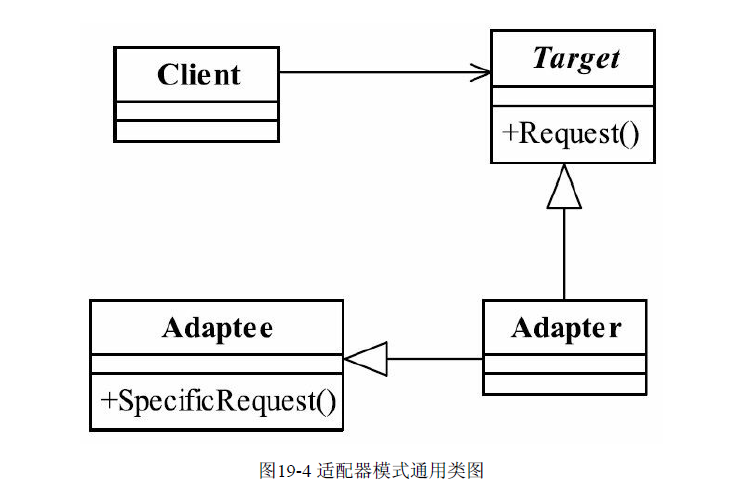
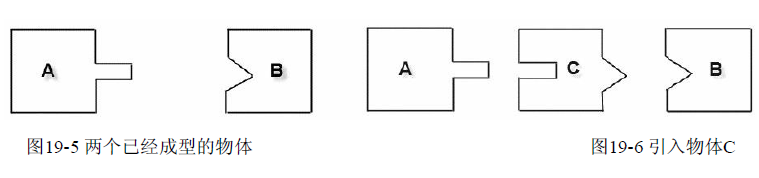
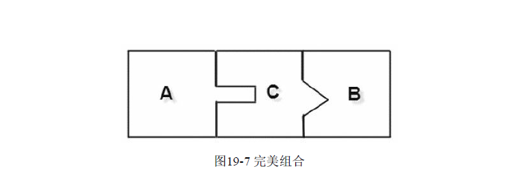
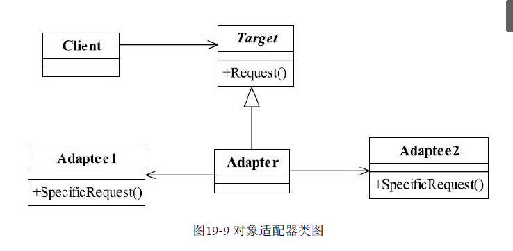

## java与设计模式-适配器模式

### 一、适配器模式的定义

适配器模式（Adapter Pattern）的定义如下：

**Convert the interface of a class into another interface clients expect.Adapter lets classes work
together that couldn't otherwise because of incompatible interfaces.（将一个类的接口变换成客户
端所期待的另一种接口，从而使原本因接口不匹配而无法在一起工作的两个类能够在一起工
作。）**

适配器模式又叫做变压器模式，也叫做包装模式（Wrapper），但是包装模式可不止一
个，还包括了装饰模式。适配器模式的通用类图，如图19-4所示。



适配器模式在生活中还是很常见的，比如你笔记本上的电源适配器，可以使用在110～
220V之间变化的电源，而笔记本还能正常工作，这也是适配器一个良好模式的体现，简单地
说，适配器模式就是把一个接口或类转换成其他的接口或类，从另一方面来说，适配器模式
也就是一个包装模式，为什么呢？它把Adaptee包装成一个Target接口的类，加了一层衣服，
包装成另外一个靓妞了。大家知道，设计模式原是为建筑设计而服务的，软件设计模式只是
借用了人家的原理而已，那我们来看看最原始的适配器是如何设计的，如图19-5所示。

A、B两个图框代表已经塑模成型的物体A和物体B，那现在要求把A和B安装在一起使
用，如何安装？两者的接口不一致，是不可能安装在一起使用的，那怎么办？引入一个物体
C，如图19-6所示。



引入物体C后，C适应了物体A的接口，同时也适应了物体B的接口，然后三者就可以组
合成一个完整的物体，如图19-7所示。



其中的物体C就是我们说的适配器，它在中间起到了角色转换的作用，把原有的长条形
接口转换了三角形接口。在我们软件业的设计模式中，适配器模式也是相似的功能，那我们
先来看看适配器模式的三个角色。

- Target目标角色
  该角色定义把其他类转换为何种接口，也就是我们的期望接口，例子中的IUserInfo接口
  就是目标角色。
- Adaptee源角色
  你想把谁转换成目标角色，这个“谁”就是源角色，它是已经存在的、运行良好的类或对
  象，经过适配器角色的包装，它会成为一个崭新、靓丽的角色。
- Adapter适配器角色
  适配器模式的核心角色，其他两个角色都是已经存在的角色，而适配器角色是需要新建
  立的，它的职责非常简单：把源角色转换为目标角色，怎么转换？通过继承或是类关联的方
  式。

各个角色的职责都已经非常清楚，我们再来看看其通用源码，目标接口如代码清单19-8
所示。其实我自己还给他多加了一类角色。（场景类---也就是实际应用的场景，由于设计模式的代码设计的让人把我
其核心逻辑，所以当其设计好之后，怎么使用这一设计模式，是我们理解和学习设计模式的重要思路（倒推法））

代码清单：目标角色

```
public interface Target {

    void request();
}
```

目标角色是一个已经在正式运行的角色，你不可能去修改角色中的方法，你能做的就是
如何去实现接口中的方法，而且通常情况下，目标角色是一个接口或者是抽象类，一般不会
是实现类。一个正在服役的目标角色，如代码所示。

```
public class ConcreteTarget implements Target {

    @Override
    public void request() {
        System.out.println("If u need help, please call me!");
    }
}
```

源角色也是已经在服役状态（当然，非要新建立一个源角色，然后套用适配器模式，那
也没有任何问题），它是一个正常的类，其源代码如下代码清单所示。

```
public class Adaptee {

    public void doSomething() {
        System.out.println("I'm kind of busy,leave me alone,pls!");
    }
}
```

我们的核心角色要出场了，适配器角色如下代码清单所示。

```
public class Adapter extends Adaptee implements Target {

    @Override
    public void request() {
        super.doSomething();
    }
}
```

所有的角色都已经在场了，那我们就开始看看这场演出，场景类如下代码清单所示。

```
public class Main {

    public static void main(String[] args) {
        // 没有和外界联系时
        IUserInfo youngGirls = new UserInfo();
        for (int i = 0; i < 100; i++) {
            System.out.println(youngGirls.getMobilePhone());
        }
        System.out.println("-----------------------------");
        // 调用外部的人员信息
        IUserInfo outYoungGirls = new OutUserInfo();
        for (int i = 0; i < 100; i++) {
            System.out.println(outYoungGirls.getMobilePhone());
        }
    }
}
```

适配器模式的原理就讲这么多吧，但是别得意得太早了，如果你认为适配器模式就这么
简单，那我告诉你，你错了！复杂的还在后面。

### 二、适配器模式的应用

#### 2.1 适配器模式的优点

- 适配器模式可以让两个没有任何关系的类在一起运行，只要适配器这个角色能够搞定
  他们就成。
- 增加了类的透明性
  想想看，我们访问的Target目标角色，但是具体的实现都委托给了源角色，而这些对高
  层次模块是透明的，也是它不需要关心的。
- 提高了类的复用度
  当然了，源角色在原有的系统中还是可以正常使用，而在目标角色中也可以充当新的演
  员。
- 灵活性非常好
  某一天，突然不想要适配器，没问题，删除掉这个适配器就可以了，其他的代码都不用
  修改，基本上就类似一个灵活的构件，想用就用，不想就卸载。

#### 2.2 适配器模式的使用场景

适配器应用的场景只要记住一点就足够了：**你有动机修改一个已经投产中的接口时，适
配器模式可能是最适合你的模式。比如系统扩展了，需要使用一个已有或新建立的类，但这
个类又不符合系统的接口，怎么办？使用适配器模式，这也是我们例子中提到的**。

#### 2.3 适配器模式的注意事项

适配器模式最好在详细设计阶段不要考虑它，它不是为了解决还处在开发阶段的问题，
而是解决正在服役的项目问题，没有一个系统分析师会在做详细设计的时候考虑使用适配器
模式，这个模式使用的主要场景是扩展应用中，就像我们上面的那个例子一样，系统扩展
了，不符合原有设计的时候才考虑通过适配器模式减少代码修改带来的风险。

再次提醒一点，项目一定要遵守依赖倒置原则和里氏替换原则，否则即使在适合使用适
配器的场合下，也会带来非常大的改造。

### 三、适配器模式的扩展

在上面那和案例代码的背景下，假如目标类中有多个功能接口，而且这多个功能接口之间功能实现不只是依赖一个被适配者对象（接口或实现类）。显而易见，上面那种以继承的
方式创建的适配器显然是不合适的。其实上面那种通过继承实现的适配器被称为“类适配器”。而我们下面要讲就是“对象适配器”，其利用的Java中关联关系。

目标接口（多个方法来模拟多种功能）：

```
public interface Target {

    /**
     * 功能1
     */
    void fun01();

    /**
     * 功能2
     */
    void fun02();

    /**
     * 功能3
     */
    void fun03();
}

```

目标接口的现有实现类：

```
public class MyTargetImpl implements Target {

    @Override
    public void fun01() {
        System.out.println("my fun01");
    }

    @Override
    public void fun02() {
        System.out.println("my fun02");
    }

    @Override
    public void fun03() {
        System.out.println("my fun03");
    }
}
```

Adaptee接口或类（多个）：

```
public class AdapteeFun01 {

    public void doIt() {
        System.out.println("out fun01");
    }
}
```

```
public class AdapteeFun02 {

    public void doXX() {
        System.out.println("out fun02");
    }
}
```

```
public class AdapteeFun03 {

    public void doYY() {
        System.out.println("out fun03");
    }
}
```

Adapter:

```
public class Adapter implements Target {

    private AdapteeFun01 adapteeFun01 = new AdapteeFun01();
    private AdapteeFun02 adapteeFun02 = new AdapteeFun02();
    private AdapteeFun03 adapteeFun03 = new AdapteeFun03();

    @Override
    public void fun01() {
        adapteeFun01.doIt();
    }

    @Override
    public void fun02() {
        adapteeFun02.doXX();
    }

    @Override
    public void fun03() {
        adapteeFun03.doYY();
    }
}
```

场景类：

```
public class Main {

    public static void main(String[] args) {
        // 原有的业务逻辑代码
        Target sourceTarget = new MyTargetImpl();
        sourceTarget.fun01();
        sourceTarget.fun02();
        sourceTarget.fun03();
        System.out.println("--------------------------------");
        // 适配后的业务逻辑代码
        Target adapterTarget = new Adapter();
        adapterTarget.fun01();
        adapterTarget.fun02();
        adapterTarget.fun03();
    }
}
```

对象适配器的通用类图:



适配器的通用代码也比较简单，把原有的继承关系变更为关联关系就可以了，不再赘
述。对象适配器和类适配器的区别是：类适配器是类间继承，对象适配器是对象的合成关
系，也可以说是类的关联关系，这是两者的根本区别。二者在实际项目中都会经常用到，由
于对象适配器是通过类间的关联关系进行耦合的，因此在设计时就可以做到比较灵活，比如
修补源角色的隐形缺陷，关联其他对象等，而类适配器就只能通过覆写源角色的方法进行扩
展，在实际项目中，对象适配器使用到场景相对较多。

### 四、适配器的最佳实践

适配器模式是一个补偿模式，或者说是一个“补救”模式，通常用来解决接口不相容的问
题，在百分之百的完美设计中是不可能使用到的，什么是百分之百的完美设计？“千虑”而没
有“一失”的设计，但是，再完美的设计也会遇到“需求”变更这个无法逃避的问题，就以我们
demo01中的人力资源管理系统为例来说，不管系统设计得多么完美，都无法逃避新业务的发生，
技术只是一个工具而已，是因为它推动了其他行业的进步和发展而具有了价值，通俗地说，
技术是为业务服务的，因此业务在日新月异变化的同时，也对技术提出了同样的要求，在这
种要求下，就需要我们有一种或一些这样的补救模式诞生，使用这些补救模式可以保证我们
的系统在生命周期内能够稳定、可靠、健壮的运行，而适配器模式就是这样的一个“救世
主”，它在需求巨变、业务飞速而导致你极度郁闷、烦躁、崩溃的时候横空出世，它通过把
非本系统接口的对象包装成本系统可以接受的对象，从而简化了系统大规模变更风险的存
在。


