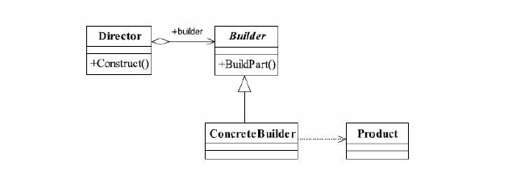

## 建造者模式（生成器模式）
### 一、定义
1. 建造者模式又叫生成器模式。其<font color='red'>**将一个复杂的对象的构建和它的表示分离，使得同样的构建过程可以创建不同的表示。**</font>(Separate the construction of a complex object from its representation so that the same
                                                                         ​    ​    ​    construction process can create different representations.)
2. 建造者通用类图结构


- Product产品类
  通常是模板方法来实现抽象的产品类。如BenzCarModel和BWMModel都是具体的产品类

- Builder抽象的建造者

  规范产品的组建，一般由子类来实现。如CarBuilder类

- ConcreteBuilder具体的建造者

  实现抽象类定义的所有方法，并且返回一个组建好的对象。例子中的BenzBuilder和
  BMWBuilder就属于具体建造者。

- Direction导演者

  负责安排已有模块的顺序，然后告诉Builder开始建造，在上面的例子中就是我们的老
  大，××公司找到老大，说我要这个或那个类型的车辆模型，然后老大就把命令传递给我，我
  和我的团队就开始拼命地建造，于是一个项目建设完毕了。
### 二、示例
#### 0.需求背景
某软件开发公司的一个下午，老板找我说 ：“××公司很满意我们
做的模型，又签订了一个合同，把奔驰、宝马的车辆模型都交给我们公司制作了，不过这次
又额外增加了一个新需求：汽车的启动、停止、喇叭声音、引擎声音都由客户自己控制，他
想什么顺序就什么顺序，这个没问题吧？”
那任务又是一个时间紧、工程量大的项目，为什么是“又”呢？因为基本上每个项目都是
如此，我该怎么来完成这个任务呢？
#### 1.产品类

抽象的产品类：

```
public abstract class CarModel {

    private List<String> sequence = new ArrayList<>();

    protected abstract void start();

    protected abstract void alarm();

    protected abstract void engineBoom();

    protected abstract void stop();

    public final void run() {
        sequence.forEach(s -> {
            if ("start".equals(s)) {
                this.start();
            } else if ("alarm".equals(s)) {
                this.alarm();
            } else if ("engineBoom".equals(s)) {
                this.engineBoom();
            } else if ("stop".equals(s)){
                this.stop();
            }
        });
    }

    public void setSequence(List<String> sequence) {
        this.sequence = sequence;
    }
}
```

具体的产品实现类：

```
public class BenzCarModel extends CarModel {

    @Override
    protected void start() {
        System.out.println("奔驰车启动了...");
    }

    @Override
    protected void alarm() {
        System.out.println("奔驰车鸣笛了...");
    }

    @Override
    protected void engineBoom() {
        System.out.println("奔驰车引擎启动了...");
    }

    @Override
    protected void stop() {
        System.out.println("奔驰车停止了...");
    }
}

```


```
public class BWMModel extends CarModel {

    @Override
    protected void start() {
        System.out.println("宝马启动了...");
    }

    @Override
    protected void alarm() {
        System.out.println("宝马鸣笛了...");
    }

    @Override
    protected void engineBoom() {
        System.out.println("宝马引擎启动了...");
    }

    @Override
    protected void stop() {
        System.out.println("宝马停止了...");
    }
}
```

#### 2.抽象创建者

```
public abstract class CarBuilder {

    public abstract void setSequence(List<String> sequence);

    public abstract CarModel getCarModel();
}

```

#### 3.具体的创建者

奔驰具体创建者：

```
public class BenzCarBuilder extends CarBuilder {

    private BenzCarModel benzCarModel = new BenzCarModel();

    @Override
    public void setSequence(List<String> sequence) {
        this.benzCarModel.setSequence(sequence);
    }

    @Override
    public CarModel getCarModel() {
        return this.benzCarModel;
    }
}
```

宝马具体创建者：

```
public class BWMModelBuilder extends CarBuilder {

    private BWMModel bwmModel = new BWMModel();

    @Override
    public void setSequence(List<String> sequence) {
        this.bwmModel.setSequence(sequence);
    }

    @Override
    public CarModel getCarModel() {
        return this.bwmModel;
    }
}

```

需要注意的是：如果有多个产品类，就需要有多个创建者，而且这多个产品类有相同的抽象类或接口。如上。

#### 4.导演类
```
public class Director {
    private List<String> sequence = new ArrayList<>();
    private BenzCarBuilder benzCarBuilder = new BenzCarBuilder();
    private BWMModelBuilder bwmModelBuilder = new BWMModelBuilder();

    public BenzCarModel getABenzCarModel() {
        this.sequence.clear();
        this.sequence.add("engineBoom");
        this.sequence.add("start");
        this.sequence.add("stop");
        this.benzCarBuilder.setSequence(this.sequence);
        return (BenzCarModel) benzCarBuilder.getCarModel();
    }

    public BenzCarModel getBBenzCarModel() {
        this.sequence.clear();
        this.sequence.add("alarm");
        this.sequence.add("engineBoom");
        this.sequence.add("start");
        this.sequence.add("stop");
        this.benzCarBuilder.setSequence(this.sequence);
        return (BenzCarModel) benzCarBuilder.getCarModel();
    }

    public BWMModel getCBWMModel() {
        this.sequence.clear();
        this.sequence.add("alarm");
        this.sequence.add("start");
        this.sequence.add("stop");
        bwmModelBuilder.setSequence(this.sequence);
        return (BWMModel) bwmModelBuilder.getCarModel();
    }

    public BWMModel getDBWMModel() {
        this.sequence.clear();
        this.sequence.add("start");
        bwmModelBuilder.setSequence(this.sequence);
        return (BWMModel) bwmModelBuilder.getCarModel();
    }
}

```
导演类起到封装的作用，避免高层模块深入到建造者内部的实现类中。当然，在建造模式比较多的
比较庞大的时候，导演类可以有多个。

### 三、应用和总结
#### 1.优点
- **封装性** 使用建造者模式额可以使客户端不必知道产品内部的组成的细节，如示例中我们不需要知道每个具体模型的具体内部细节及实现，产生对象就是CarModel.
- **建造者独立，容易拓展**  不同Builder之间是相互独立的，拓展性强
- **便于控制细节和风险** 首先建造者之间是相互独立的，不对其他模块产生影响。其次，对象通过多个步骤进行创建，并且可以根据需要改变其实某一点实现的细节。

#### 2.使用场景
- 相同的方法，不同的执行顺序，产生不同的事件结果时，可以采用建造者模式。
- 多个部件或零件，都可以装配到一个对象中，但是产生的运行结果又不相同时，则可
  以使用该模式。
- 产品类非常复杂，或者产品类中的调用顺序不同产生了不同的效能，这个时候使用建
  造者模式非常合适。
- 在对象创建过程中会使用到系统中的一些其他对象，这些对象在产品对象的创建过程
  中不易得到时，也可以采用建造者模式封装该对象的创建过程。该种场景只能是一个补偿方
  法，因为一个对象不容易获得，而在设计阶段竟然没有发觉，而要通过创建者模式柔化创建
  过程，本身已经违反设计的最初目标。
#### 3.和工厂模式的区别
1. **建造者关于的零件类型和装配工艺（顺序），它与工厂模式最大的不同就是虽然同为创建类模式，但是关注的重点不同。**
2. **建造者模式最主要的功能是基本方法的
     调用顺序安排，也就是这些基本方法已经实现了，通俗地说就是零件的装配，顺序不同产生
     的对象也不同；而工厂方法则重点是创建，创建零件是它的主要职责，组装顺序则不是它关
     心的。**
#### 4.关于建造者模式拓展的思考
>已经不用扩展了，因为我们在汽车模型制造的例子中已经对建造者模式进行了扩展，引
 入了模板方法模式。可能大家会比较疑惑，为什么在其他介绍设计模式的书籍上创建者模式
 并不是这样说的？读者请注意，建造者模式中还有一个角色没有说明，就是零件，建造者怎
 么去建造一个对象？是零件的组装，组装顺序不同对象效能也不同，这才是建造者模式要表
 达的核心意义，而怎么才能更好地达到这种效果呢？引入模板方法模式是一个非常简单而有
 效的办法。

 >大家看到这里估计就开始犯嘀咕了，这个建造者模式和工厂模式非常相似呀，是的，非
 常相似，但是记住一点你就可以游刃有余地使用了：建造者模式最主要的功能是基本方法的
 调用顺序安排，也就是这些基本方法已经实现了，通俗地说就是零件的装配，顺序不同产生
 的对象也不同；而工厂方法则重点是创建，创建零件是它的主要职责，组装顺序则不是它关
 心的。

参考：《设计模式之禅》、《Head First设计模式》及一些网络上的博客