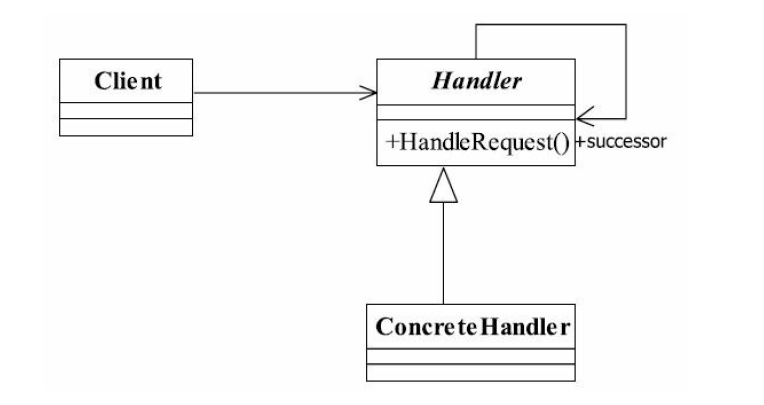

## java与设计模式-责任链模式

### 一、 责任链模式的定义

责任链模式定义如下：

Avoid coupling the sender of a request to its receiver by giving more than one object a chance to
handle the request.Chain the receiving objects and pass the request along the chain until an object
handles it.（使多个对象都有机会处理请求，从而避免了请求的发送者和接受者之间的耦合关
系。将这些对象连成一条链，并沿着这条链传递该请求，直到有对象处理它为止。）

责任链模式的重点是在“链”上，由一条链去处理相似的请求在链中决定谁来处理这个请
求，并返回相应的结果，其通用类图如图16-4所示。

### 二、 责任链模式的类图关系



### 三、 分析
1. 抽象处理者
   
   抽象的处理者实现三个职责：一是定义一个请求的处理方法handleMessage，唯一对外开
   放的方法；二是定义一个链的编排方法setNext，设置下一个处理者；三是定义了具体的请求
   者必须实现的两个方法：定义自己能够处理的级别getHandlerLevel和具体的处理任务echo。
   
   注意：
   >在责任链模式中一个请求发送到链中后，前一节点消费部分消息，然后交由后续
    节点继续处理，最终可以有处理结果也可以没有处理结果，读者可以不用理会什么纯的、不
    纯的责任链模式。同时，请读者注意handlerMessage方法前的final关键字，可以阅读第10章
    的模板方法模式。
2. 具体的处理者（一般是多个）
   
   定义三个具体的处理者，以便可以组成一个链.
   
   在处理者中涉及三个类：Level类负责定义请求和处理级别，Request类负责封装请
   求，Response负责封装链中返回的结果，该三个类都需要根据业务产生，读者可以在实际应
   用中完成相关的业务填充，
   
   **最后，在场景类或高层模块中对链进行组装，并传递请求，返回结果.**
   
### 四、示例Demo
1. 抽象处理者
   ``` 
   public abstract class Handler {
   
       private Handler nextHandler;
   
       /**
        * 每个处理者都有一个处理级别
        *
        * @return
        */
       protected abstract Level getHandlerLevel();
   
       /**
        * 每个处理者都必须实现处理任务
        *
        * @param request
        * @return
        */
       protected abstract Response echo(Request request);
   
       /**
        * 设置下一个处理者是谁
        *
        * @param nextHandler
        */
       public void setNext(Handler nextHandler) {
           this.nextHandler = nextHandler;
       }
   
       /**
        * 每个处理者都必须对请求做出处理
        *
        * @param request
        * @return
        */
       public final Response handleMessage(Request request) {
           Response response = null;
           // 判断是否是自己的处理级别
           if (this.getHandlerLevel().equals(request.getLevel())) {
               response = this.echo(request);
           } else {
               // 判断是否有下一个处理者
               if (null != this.nextHandler) {
                   response = this.nextHandler.handleMessage(request);
               } else {
                   // 没有适当的处理人，业务自行进行处理
               }
           }
           return response;
       }
   
   }
   ```
2. 具体的处理者
   
   - 具体处理1
     ``` 
     public class ConcreteHandler01 extends Handler {
     
         /**
          * 设置自己的处理级别
          *
          * @return
          */
         @Override
         protected Level getHandlerLevel() {
             return null;
         }
     
         /**
          * 定义自己的处理逻辑
          *
          * @param request
          * @return
          */
         @Override
         protected Response echo(Request request) {
             return null;
         }
     }
     ```
   - 具体处理2
     ``` 
     public class ConcreteHandler02 extends Handler {
     
         @Override
         protected Level getHandlerLevel() {
             return null;
         }
     
         @Override
         protected Response echo(Request request) {
             return null;
         }
     }
     ```
   - 具体处理3
     ``` 
     public class ConcreteHandler03 extends Handler {
     
         @Override
         protected Level getHandlerLevel() {
             return null;
         }
     
         @Override
         protected Response echo(Request request) {
             return null;
         }
     }
     ```
 3. 场景使用类
    
    ``` 
    public class Main {
    
        public static void main(String[] args) {
            // 1. 声明所有相关连
            Handler handler01 = new ConcreteHandler01();
            Handler handler02 = new ConcreteHandler02();
            Handler handler03 = new ConcreteHandler03();
    
            // 2. 设置连中的顺序1->2->3
            handler01.setNext(handler02);
            handler02.setNext(handler03);
    
            // 3. 提交结果，返回请求
            handler01.handleMessage(new Request());
        }
    }
    ```
    
    >在实际应用中，一般会有一个封装类对责任模式进行封装，也就是替代Main类，直接
     返回链中的第一个处理者，具体链的设置不需要高层次模块关系，这样，更简化了高层次模
     块的调用，减少模块间的耦合，提高系统的灵活性。
### 五、责任链模式的应用
1. 责任链模式的优点
   
   责任链模式非常显著的优点是将请求和处理分开。请求者可以不用知道是谁处理的，处
   理者可以不用知道请求的全貌（例如在J2EE项目开发中，可以剥离出无状态Bean由责任链处
   理），两者解耦，提高系统的灵活性。
2. 责任链模式的缺点
   
   责任链有两个非常显著的缺点：一是性能问题，每个请求都是从链头遍历到链尾，特别
   是在链比较长的时候，性能是一个非常大的问题。二是调试不很方便，特别是链条比较长，
   环节比较多的时候，由于采用了类似递归的方式，调试的时候逻辑可能比较复杂。
3. 责任链模式的注意事项
   
   链中节点数量需要控制，避免出现超长链的情况，一般的做法是在Handler中设置一个
   最大节点数量，在setNext方法中判断是否已经是超过其阈值，超过则不允许该链建立，避免
   无意识地破坏系统性能。
### 六、最佳实践
在例子和通用源码中Handler是抽象类，融合了模板方法模式，每个实现类只要实现两
个方法：echo方法处理请求和getHandlerLevel获得处理级别，想想单一职责原则和迪米特法
则吧，通过融合模板方法模式，各个实现类只要关注的自己业务逻辑就成了，至于说什么事
要自己处理，那就让父类去决定好了，也就是说父类实现了请求传递的功能，子类实现请求
的处理，符合单一职责原则，各个实现类只完成一个动作或逻辑，也就是只有一个原因引起
类的改变，我建议大家在使用的时候用这种方法，好处是非常明显的了，子类的实现非常简
单，责任链的建立也是非常灵活的。

责任链模式屏蔽了请求的处理过程，你发起一个请求到底是谁处理的，这个你不用关
心，只要你把请求抛给责任链的第一个处理者，最终会返回一个处理结果（当然也可以不做
任何处理），作为请求者可以不用知道到底是需要谁来处理的，这是责任链模式的核心，同
时责任链模式也可以作为一种补救模式来使用。举个简单例子，如项目开发的时候，需求确
认是这样的：一个请求（如银行客户存款的币种），一个处理者（只处理人民币），但是随
着业务的发展（改革开放了嘛，还要处理美元、日元等），处理者的数量和类型都有所增
加，那这时候就可以在第一个处理者后面建立一个链，也就是责任链来处理请求，如果是人
民币，好，还是第一个业务逻辑来处理；如果是美元，好，传递到第二个业务逻辑来处理；
日元、欧元……这些都不用在对原有的业务逻辑产生很大改变，通过扩展实现类就可以很好
地解决这些需求变更的问题。

责任链在实际的项目中使用也是比较多的，我曾经做过这样一个项目，界面上有一个用
户注册功能，注册用户分两种，一种是VIP用户，也就是在该单位办理过业务的，一种是普
通用户，一个用户的注册要填写一堆信息，VIP用户只比普通用户多了一个输入项：VIP序列
号。注册后还需要激活，VIP和普通用户的激活流程也是不同的，VIP是自动发送邮件到用户
的邮箱中就算激活了，普通用户要发送短信才能激活，为什么呢？获得手机号码以后好发广
告短信啊！项目组就采用了责任链模式，甭管从前台传递过来的是VIP用户信息还是普通用
户信息，统一传递到一个处理入口，通过责任链来完成任务的处理。


