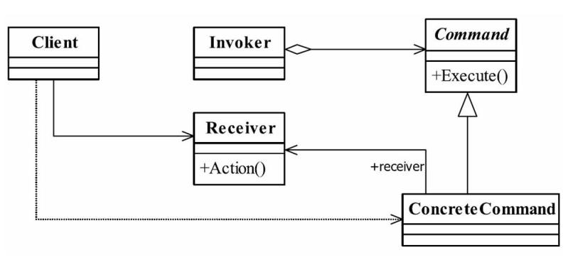

# java与设计模式-命令模式

## 一、定义

命令模式是一个高内聚的模式， 其定义为： Encapsulate a request as an object,thereby
letting you parameterize clients with different requests,queue or log requests,and support undoable
operations.（将一个请求封装成一个对象， 从而让你使用不同的请求把客户端参数化， 对请
求排队或者记录请求日志， 可以提供命令的撤销和恢复功能。 ）


## 二、通用关系图



## 三、设计思想和角色

根据上一小节的图，我们可以获取：

#### Receive接收者角色

该角色就是干活的角色， 命令传递到这里是应该被执行的。如果不理解的话继续往下看。

#### Command命令角色

需要执行的所有命令都在这里声明。

#### Invoker调用者角色

接收到命令， 并执行命令。 

#### 场景类或调用类(非必须)

测试中可能就是一个Main方法，实际项目可能是一个业务类。

命令模式比较简单， 但是在项目中非常频繁地使用， 因为它的封装性非常好， 把请求方
（Invoker） 和执行方（Receiver） 分开了， 扩展性也有很好的保障， 通用代码比较简单。在下一小节我们可以把根据上述描述把代码实现。

## 四、经典实现

#### Receiver类及其实现类

```java
public abstract class Receiver {

    /**
     * 定义接受者，定义每个接受者必须完成的业务处理
     */
    public abstract void doSomething();

}
```

很奇怪， 为什么Receiver是一个抽象类？ 那是因为接收者可以有多个， 有多个就需要定
义一个所有特性的抽象集合——抽象的接收者。

```java
public class ConcreteReceiver01 extends Receiver {

    /**
     * 具体接受者1需要完成的业务处理逻辑
     */
    @Override
    public void doSomething() {
        System.out.println("业务处理1...");
    }
}
```

```java
public class ConcreteReceiver02 extends Receiver {

    /**
     * 具体接受者2需要完成的业务处理逻辑
     */
    @Override
    public void doSomething() {
        System.out.println("业务处理2...");
    }
}
```

```java
public class ConcreteReceiver03 extends Receiver {

    /**
     * 具体接受者2需要完成的业务处理逻辑
     */
    @Override
    public void doSomething() {
        System.out.println("业务处理3...");
    }
}
```

#### Command类及其实现类（命令角色是命令模式的核心）

```java
public abstract class Command {

    /**
     * 每个命令类都必须有一个执行方法
     */
    public abstract void execute();
}
```

根据环境的需求， 具体的命令类也可以有N个， 其实现类如下。

```java
public class ConcreteCommand01 extends Command {

    private Receiver receiver;

    public ConcreteCommand01(Receiver receiver) {
        this.receiver = receiver;
    }

    /**
     * 具体命令类的执行方法
     */
    @Override
    public void execute() {
        receiver.doSomething();
    }
}
```

```java
public class ConcreteCommand02 extends Command {

    private Receiver receiver;

    public ConcreteCommand02(Receiver receiver) {
        this.receiver = receiver;
    }

    /**
     * 具体命令类的执行方法
     */
    @Override
    public void execute() {
        receiver.doSomething();
    }
}
```

```java
public class ConcreteCommand03 extends Command {

    /**
     * 对哪个Receiver类进行命令处理
     */
    private Receiver receiver;

    /**
     * 构造函数接受参数
     *
     * @param receiver receiver
     */
    public ConcreteCommand03(Receiver receiver) {
        this.receiver = receiver;
    }

    /**
     * 具体命令类的执行方法
     */
    @Override
    public void execute() {
        receiver.doSomething();
    }
}
```

定义了两个具体的命令类， 读者可以在实际应用中扩展该命令类。 在每个命令类中， 通
过构造函数定义了该命令是针对哪一个接收者发出的， 定义一个命令接收的主体。 调用者非
常简单， 仅实现命令的传递。

#### 调用者Invoker类

```java
public class Invoker {

    private Command command;

    /**
     * 执行命令
     */
    public void action() {
        this.command.execute();
    }

    public void setCommand(Command command) {
        this.command = command;
    }
}

```

#### 高层调用者

那我们来看高层模块如何调用命令模式的，代码如下。

```java
public class Main {


    public static void main(String[] args) {
        // 首先声明调用者Invoker
        Invoker invoker = new Invoker();
        // 定义接受者
        ConcreteReceiver01 concreteReceiver01 = new ConcreteReceiver01();
        // 定义一个发送给接受者的命令
        ConcreteCommand01 command01 = new ConcreteCommand01(concreteReceiver01);
        // 把命令交给调用者去执行
        invoker.setCommand(command01);
        invoker.action();
    }
}
```

运行结果如下：

```text
业务处理1...
```

一个完整的命令模式就此完成,大家可以再其基础进行自主拓展。

## 五、命令模式的应用

#### 5.1 命令模式的优点
- 类间解耦
调用者角色与接收者角色之间没有任何依赖关系， 调用者实现功能时只需调用Command
抽象类的execute方法就可以， 不需要了解到底是哪个接收者执行。
- 可扩展性
Command的子类可以非常容易地扩展， 而调用者Invoker和高层次的模块Client不产生严
重的代码耦合。
- 命令模式结合其他模式会更优秀
命令模式可以结合责任链模式， 实现命令族解析任务； 结合模板方法模式， 则可以减少
Command子类的膨胀问题。

#### 5.2 命令模式的缺点
命令模式也是有缺点的， 请看Command的子类： 如果有N个命令， 问题就出来
了， Command的子类就可不是几个， 而是N个， 这个类膨胀得非常大， 这个就需要读者在项
目中慎重考虑使用。

#### 5.3 命令模式的使用场景

只要你认为是命令的地方就可以采用命令模式， 例如， 在GUI开发中， 一个按钮的点击
是一个命令， 可以采用命令模式； 模拟DOS命令的时候， 当然也要采用命令模式； 触发－反馈机制的处理等

#### 5.4 最佳实践

其实在上述的代码中，我们的高层模块中还是出现Receiver这样比较低层的模块，其实这就是耦合。

在通用的类图和源码中却出现了Client类对Receiver角色的依赖， 这是为什么呢？
如果你发现了这个问题， 则说明你阅读得非常仔细， 好习惯！ 每一个模式到实际应用的
时候都有一些变形， 命令模式的Receiver在实际应用中一般都会被封装掉（除非非常必要，
例如撤销处理） ， 那是因为在项目中： 约定的优先级最高， 每一个命令是对一个或多个
Receiver的封装， 我们可以在项目中通过有意义的类名或命令名处理命令角色和接收者角色
的耦合关系（这就是约定） ， 减少高层模块（Client类） 对低层模块（Receiver角色类） 的依
赖关系， 提高系统整体的稳定性。 因此， 建议大家在实际的项目开发时采用封闭Receiver的
方式（当然了， 仁者见仁， 智者见智） ， 减少Client对Reciver的依赖， 该方案只是对
Command抽象类及其子类有一定的修改。


## 一、定义
## 一、定义
## 一、定义


