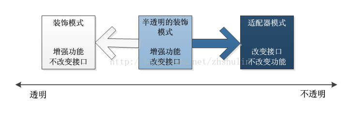

# java与设计模式-装饰模式

## 一、装饰模式的定义

装饰模式（Decorator Pattern）是一种比较常见的模式，其定义如下：Attach additional
responsibilities to an object dynamically keeping the same interface.Decorators provide a flexible
alternative to subclassing for extending functionality.（动态地给一个对象添加一些额外的职责。
就增加功能来说，装饰模式相比生成子类更为灵活。）

装饰模式的通用类图如下所示。、


在类图中，有四个角色需要说明：

- Component抽象构件
  Component是一个接口或者是抽象类，就是定义我们最核心的对象，也就是最原始的对
  象。
  > 注意：在装饰模式中，必然有一个最基本、最核心、最原始的接口或抽象类充当
    Component抽象构件。
- ConcreteComponent具体构件
  ConcreteComponent是最核心、最原始、最基本的接口或抽象类的实现，你要装饰的就是
  它。
- Decorator装饰角色
  一般是一个抽象类，做什么用呢？实现接口或者抽象方法，它里面可不一定有抽象的方
  法呀，在它的属性里必然有一个private变量指向Component抽象构件。
- 具体装饰角色
  ConcreteDecoratorA和ConcreteDecoratorB是两个具体的装饰类，你要把你最核心的、最
  原始的、最基本的东西装饰成其他东西。

装饰模式的所有角色都已经解释完毕，我们来看看如何实现，先看：

**抽象构件**，代码如下：

```
public abstract class Component {

    public abstract void operate();
}
```

**具体构件**代码如下：

```
public class ConcreteComponent extends Component {

    @Override
    public void operate() {
        System.out.println("基础操作：do something.");
    }
}
```

**抽象装饰者**,代码如下：

```
public abstract class Decorator extends Component {
    private Component component;

    public Decorator(Component component ) {
        this.component = component;
    }

    @Override
    public void operate() {
        this.component.operate();
    }
}
```

当然了，若只有一个装饰类，则可以没有抽象装饰角色，直接实现具体的装饰角色即
可。


**具体的装饰**类实现，代码如下：

```
// 具体的装饰类1
public class ConcreteDecorator1 extends Decorator {

    public ConcreteDecorator1(Component component) {
        super(component);
    }


    @Override
    public void operate() {
        System.out.println("附加功能1：run");
        super.operate();
    }
}
```

```
// 具体的装饰类2
public class ConcreteDecorator2 extends Decorator {


    public ConcreteDecorator2(Component component) {
        super(component);
    }

    @Override
    public void operate() {
        super.operate();
        System.out.println("附加功能2：run");
    }
}
```

**模拟客户端进行使用**：

```
public class Main {

    public static void main(String[] args) {
        Component component = new ConcreteComponent();
        ConcreteDecorator1 cd1 = new ConcreteDecorator1(component);
        ConcreteDecorator2 cd2 = new ConcreteDecorator2(cd1);
        cd2.operate();

        // 执行结果如下：
        /**
         *
         * 附加功能1：run
         * 基础操作：do something.
         * 附加功能2：run
         *
         */
    }
}

```

## 二、装饰模式应用

### 1. 装饰模式的优点

- 装饰类和被装饰类可以独立发展，而不会相互耦合。换句话说，Component类无须知
  道Decorator类，Decorator类是从外部来扩展Component类的功能，而Decorator也不用知道具
  体的构件。
- 装饰模式是继承关系的一个替代方案。我们看装饰类Decorator，不管装饰多少层，返
  回的对象还是Component，实现的还是is-a的关系。
- 装饰模式可以动态地扩展一个实现类的功能，这不需要多说，装饰模式的定义就是如
  此。

### 2. 装饰模式的缺点

- 对于装饰模式记住一点就足够了：多层的装饰是比较复杂的。为什么会复杂呢？你想想
  看，就像剥洋葱一样，你剥到了最后才发现是最里层的装饰出现了问题，想象一下工作量
  吧，因此，尽量减少装饰类的数量，以便降低系统的复杂度。

### 3. 装饰模式的使用场景

- 需要扩展一个类的功能，或给一个类增加附加功能。
- 需要动态地给一个对象增加功能，这些功能可以再动态地撤销。
- 需要为一批的兄弟类进行改装或加装功能，当然是首选装饰模式。

## 三、最佳实践

装饰模式是对继承的有力补充。你要知道继承不是万能的，继承可以解决实际的问题，
但是在项目中你要考虑诸如易维护、易扩展、易复用等，而且在一些情况下（比如上面那个
成绩单例子）你要是用继承就会增加很多子类，而且灵活性非常差，那当然维护也不容易
了，也就是说装饰模式可以替代继承，解决我们类膨胀的问题。同时，你还要知道继承是静
态地给类增加功能，而装饰模式则是动态地增加功能，在上面的那个例子中，我不想要
SortDecorator这层的封装也很简单，于是直接在Father中去掉就可以了，如果你用继承就必须
修改程序。

装饰模式还有一个非常好的优点：扩展性非常好。在一个项目中，你会有非常多的因素
考虑不到，特别是业务的变更，不时地冒出一个需求，尤其是提出一个令项目大量延迟的需
求时，那种心情是相当的难受！装饰模式可以给我们很好的帮助，通过装饰模式重新封装一
个类，而不是通过继承来完成，简单点说，三个继承关系Father、Son、GrandSon三个类，我
要在Son类上增强一些功能怎么办？我想你会坚决地顶回去！不允许，对了，为什么呢？你
增强的功能是修改Son类中的方法吗？增加方法吗？对GrandSon的影响呢？特别是GrandSon
有多个的情况，你会怎么办？这个评估的工作量就够你受的，所以这是不允许的，那还是要
解决问题的呀，怎么办？通过建立SonDecorator类来修饰Son，相当于创建了一个新的类，这
个对原有程序没有变更，通过扩展很好地完成了这次变更。

## 四、半透明的装饰模式

### 1. 装饰模式的透明和半透明的区别在于：

- 装饰角色的接口与抽象构件角色的接口是否完全一致。
透明的装饰模式也就是理想的装饰模式，要求具体构件角色、装饰角色接口与抽象构件角色的接口一致。
相反，装饰角色的接口和抽象构件角色接口不一致，也就是说装饰角色接口比抽象构件的接口宽的话，此时
装饰角色变成了一个适配器角色，这种装饰角色是可接受的，被称为半透明装饰模式。

- 关系结构图如下  


### 2. 装饰模式和适配器模式的区别

- 适配器模式和装饰模式都是“包装模式”，他们都是通过封装其他对象来达到设计目的，但是他们的形态
有很大的区别。
- 理想的装饰模式在对被装饰对象进行功能增强的同时，要求具体构件角色、装饰角色的接口与抽象构件角色的接口完全一致。而适配器模式则不然，
一般而言，适配器模式并不要求对源对象的功能进行增强，但是会改变源对象的接口，以便和目标接口相符合。
- 在适配器模式里面，适配器类的接口通常会与目标类的接口重叠，但往往并不完全相同。换言之，适配器类的接口会比被装饰的目标类接口宽。

## 五、在MyBatis和Spring中的应用

MyBatis中的缓存模块使用的变形后的装饰模式：只有构件接口（Cache），基础构件接口实现（PerpetualCache）和具体装饰类(BlockingCache、FifoCache、LruCache)的实现。
感兴趣的同学可以阅读下相关代码实现。

Java中的IO模块的设计也是使用了适配器模式，进行功能的动态添加和去粗。

后续再补充Spring中的使用。


