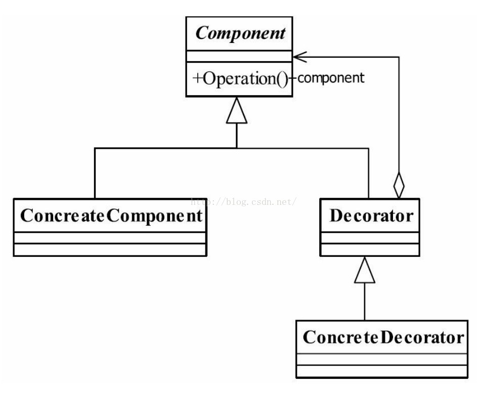
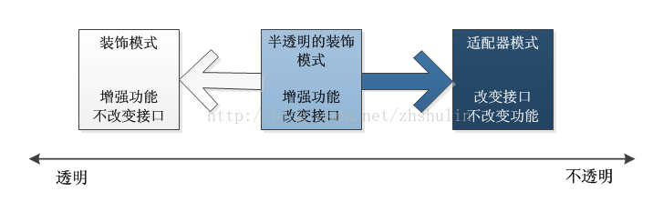

#装饰模式
##定义
装饰模式（Decorator Pattern）是一种比较常见的模式，其定义如下：Attach additionalresponsibilities to an object dynamically keeping the same interface.Decoratorsprovide a flexible alternative to subclassing for extending functionality.（ 动态地给一个对象添加一些额外的职责。就增加功能来说，装饰模式相比生成子类更为灵活。）  
##通用类图

##组件说明
1.Component抽象构件  
Component是一个接口或者是抽象类，就是定义我们最核心的对象，也就是最原始的对象，如上面的成绩单。  
注意： 在装饰模式中，必然有一个最基本、最核心、最原始的接口或抽象类充当Component抽象构件。  
2.ConcreteComponent 具体构件  
ConcreteComponent是最核心、最原始、最基本的接口或抽象类的实现，你要装饰的就是它。  
3.Decorator装饰角色  
一般是一个抽象类，做什么用呢？实现接口或者抽象方法，它里面可不一定有抽象的方法呀，在它的属性里必然有一个private变量指向Component抽象构件  
4.具体装饰角色  
ConcreteDecoratorA和ConcreteDecoratorB是两个具体的装饰类，你要把你最核心的、最原始的、最基本的东西装饰成其他东西，上面的例子就是把一个比较平庸的成绩单装饰成家长认可的成绩单。  
##装饰模式的应用
###优点
- 装饰类和被装饰类可以独立发展，而不会相互耦合。换句话说，Component类无须知道Decorator类，Decorator类是从外部来扩展Component类的功能，而Decorator也不用知道具体的构件。
- 装饰模式是继承关系的一个替代方案。我们看装饰类Decorator，不管装饰多少层，返回的对象还是Component，实现的还是is-a的关系。
- 装饰模式与继承关系的目的都是要扩展对象的功能，但是装饰模式可以提供比继承更多的灵活性。装饰模式允许系统动态决定“贴上”一个需要的“装饰”，或者除掉一个不需要的“装饰”。继承关系则不同，继承关系是静态的，它在系统运行前就决定了
- 过使用不同的具体装饰类以及这些装饰类的排列组合，设计师可以创造出很多不同行为的组合
###缺点
- 由于使用装饰模式，可以比使用继承关系需要较少数目的类。使用较少的类，当然使设计比较易于进行。但是，在另一方面，使用装饰模式会产生比使用继承关系更多的对象。更多的对象会使得查错变得困难，特别是这些对象看上去都很相像。
- 多层的装饰是比较复杂的。
###使用场景
- 需要扩展一个类的功能，或给一个类增加附加功能。
- 需要动态地给一个对象增加功能，这些功能可以再动态地撤销。
- 需要为一批的兄弟类进行改装或加装功能，当然是首选装饰模式。
###半透明的装饰模式
装饰模式的透明和半透明的区别在于：  
- 装饰角色的接口与抽象构件角色的接口是否完全一致。
透明的装饰模式也就是理想的装饰模式，要求具体构件角色、装饰角色接口与抽象构件角色的接口一致。
相反，装饰角色的接口和抽象构件角色接口不一致，也就是说装饰角色接口比抽象构件的接口宽的话，此时
装饰角色变成了一个适配器角色，这种装饰角色是可接受的，被称为半透明装饰模式。
- 关系结构图如下  

###装饰模式和适配器模式的区别
- 适配器模式和装饰模式都是“包装模式”，他们都是通过封装其他对象来达到设计目的，但是他们的形态
有很大的区别。
- 理想的装饰模式在对被装饰对象进行功能增强的同时，要求具体构件角色、装饰角色的接口与抽象构件角色的接口完全一致。而适配器模式则不然，
一般而言，适配器模式并不要求对源对象的功能进行增强，但是会改变源对象的接口，以便和目标接口相符合。
- 在适配器模式里面，适配器类的接口通常会与目标类的接口重叠，但往往并不完全相同。换言之，适配器类的接口会比被装饰的目标类接口宽。
