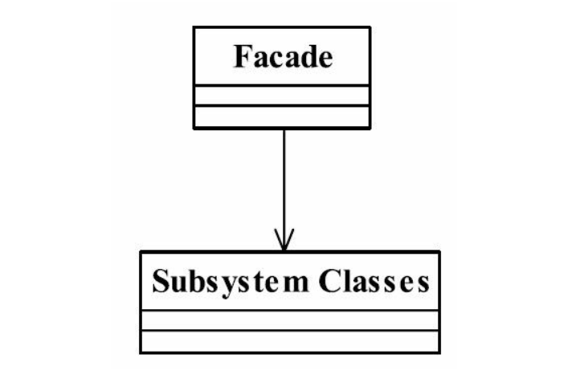
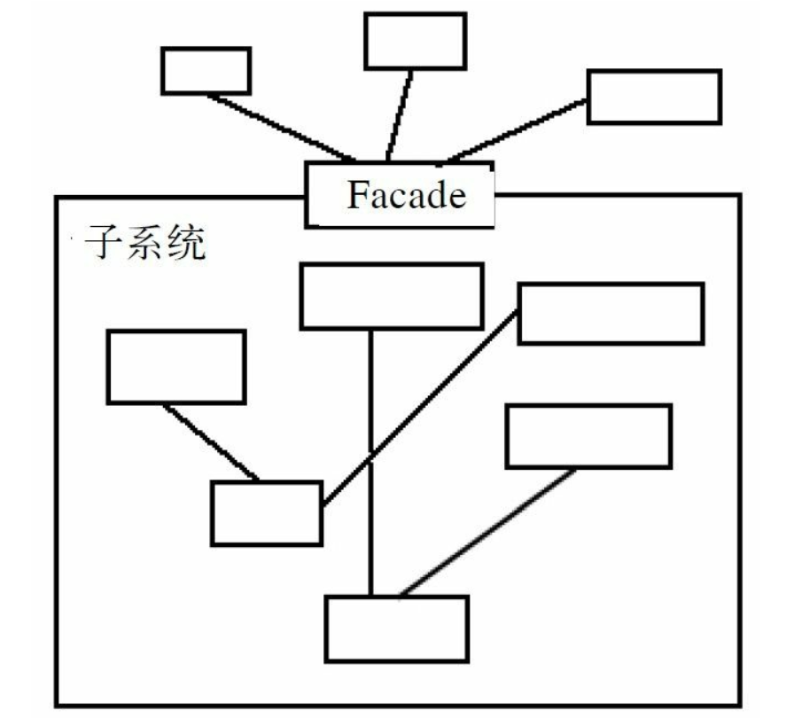

## java与设计模式-门面模式（外观模式）

### 一、定义
K
门面模式（Facade Pattern） 也叫做外观模式， 是一种比较常用的封装模式， 其定义如下：

Provide a unified interface to a set of interfaces in a subsystem.Facade defines a higher-levelinterface that makes the subsystem easier to use.（要求一个子系统的外部与其内部的通信必须通
过一个统一的对象进行。 门面模式提供一个高层次的接口， 使得子系统更易于使用。 ）

### 二、通用类图



门面模式注重“统一的对象”， 也就是提供一个访问子系统的接口， 除了这个接口不允许有任何访问子系统的行为发生。

是的， 类图就这么简单， 但是它代表的意义可是异常复杂， Subsystem Classes是子系统所有类的简称， 它可能代表一个类， 也可能代表几十个对象的集合。 甭管多少对象， 我们把这些对象全部圈入子系统的范畴.



再简单地说， 门面对象是外界访问子系统内部的唯一通道， 不管子系统内部是多么杂乱无章， 只要有门面对象在， 就可以做到“金玉其外， 败絮其中”。

### 三、角色分析

- Facade门面角色

客户端可以调用这个角色的方法。 此角色知晓子系统的所有功能和责任。 一般情况下，本角色会将所有从客户端发来的请求委派到相应的子系统去， 也就说该角色没有实际的业务逻辑， 只是一个委托类。

- subsystem子系统角色

可以同时有一个或者多个子系统。 每一个子系统都不是一个单独的类， 而是一个类的集合。 子系统并不知道门面的存在。 对于子系统而言， 门面仅仅是另外一个客户端而已。


### 四、经典代码实现

**业务子系统**

```java
public class ClassA {

    public void doSomethingA() {
        System.out.println("class a 业务逻辑处理...");
    }
}
```

```java
public class ClassB {

    public void doSomethingB() {
        System.out.println("class b 业务逻辑处理...");
    }
}
```

```java
public class ClassC {

    public void doSomethingC() {
        System.out.println("class c 业务逻辑处理...");
    }
}
```

**门面角色**

```java
public class Facade {

    /**
     * 被委托的对象
     */

    private ClassA classA = new ClassA();

    private ClassB classB = new ClassB();

    private ClassC classC = new ClassC();

    /**
     * 提供给外部的接口
     */

    public void methodA() {
        this.classA.doSomethingA();
    }

    public void methodB() {
        this.classB.doSomethingB();
    }

    public void methodC() {
        this.classC.doSomethingC();
    }

}
```


### 五、门面模式的应用

**5.1 门面模式的优点**

- 减少系统的相互依赖

想想看， 如果我们不使用门面模式， 外界访问直接深入到子系统内部， 相互之间是一种强耦合关系， 你死我就死， 你活我才能活， 这样的强依赖是系统设计所不能接受的， 门面模
式的出现就很好地解决了该问题， 所有的依赖都是对门面对象的依赖， 与子系统无关.

- 提高了灵活性

依赖减少了， 灵活性自然提高了。 不管子系统内部如何变化， 只要不影响到门面对象，任你自由活动。

- 提高安全性

想让你访问子系统的哪些业务就开通哪些逻辑， 不在门面上开通的方法， 你休想访问到。

**5.2 门面模式的缺点**

门面模式最大的缺点就是不符合开闭原则， 对修改关闭， 对扩展开放， 看看我们那个门面对象吧， 它可是重中之重， 一旦在系统投产后发现有一个小错误， 你怎么解决？ 完全遵从
开闭原则， 根本没办法解决。 继承？ 覆写？ 都顶不上用， 唯一能做的一件事就是修改门面角色的代码， 这个风险相当大， 这就需要大家在设计的时候慎之又慎， 多思考几遍才会有好收获.

**5.3 门面模式的使用场景**

- 为一个复杂的模块或子系统提供一个供外界访问的接口
- 子系统相对独立——外界对子系统的访问只要黑箱操作即可

比如利息的计算问题， 没有深厚的业务知识和扎实的技术水平是不可能开发出该子系统的， 但是对于使用该系统的开发人员来说， 他需要做的就是输入金额以及存期， 其他的都不
用关心， 返回的结果就是利息， 这时候， 门面模式是非使用不可了.

- 预防低水平人员带来的风险扩散

比如一个低水平的技术人员参与项目开发， 为降低个人代码质量对整体项目的影响风险， 一般的做法是“画地为牢”， 只能在指定的子系统中开发， 然后再提供门面接口进行访问操作。

**5.4 门面模式的注意事项**

- 一个子系统可以有多个门面

一般情况下， 一个子系统只要有一个门面足够了， 在什么情况下一个子系统有多个门面呢？ 以下列举了几个例子。

_门面已经庞大到不能忍受的程度_

比如一个纯洁的门面对象已经超过了200行的代码， 虽然都是非常简单的委托操作， 也建议拆分成多个门面， 否则会给以后的维护和扩展带来不必要的麻烦。 那怎么拆分呢？ 按照
功能拆分是一个非常好的原则， 比如一个数据库操作的门面可以拆分为查询门面、 删除门面、 更新门面等。

_子系统可以提供不同访问路径_

我们以门面模式的通用源代码为例。 ClassA、 ClassB、 ClassC是一个子系统的中3个对象， 现在有两个不同的高层模块来访问该子系统， 模块一可以完整的访问所有业务逻辑， 也
就是通用代码中的Facade类， 它是子系统的信任模块； 而模块二属于受限访问对象， 只能访问methodB方法， 那该如何处理呢？ 在这种情况下， 就需要建立两个门面以供不同的高层模
块来访问， 在原有的通用源码上增加一个新的门面即可。

```java
public class Facaed2 {
    private Facade facade = new Facade();
    
    private void methodB() {
        this.facade.methodB();
    }

}
```

增加的门面非常简单， 委托给了已经存在的门面对象Facade进行处理， 为什么要使用委托而不再编写一个委托到子系统的方法呢？ 那是因为在面向对象的编程中， 尽量保持相同的代码只编写一遍， 避免以后到处修改相似代码的悲剧.

- 门面不参与子系统内的业务逻辑

举一个例子来说明， 还是以通用源代码为例。 我们把门面上的methodC上的逻辑修改一下， 它必须先调用ClassA的doSomethingA方法， 然后再调用ClassC的doSomethingC方法。

```java
public class Facade {

    /**
     * 被委托的对象
     */

    private ClassA classA = new ClassA();

    private ClassB classB = new ClassB();

    private ClassC classC = new ClassC();

    /**
     * 提供给外部的接口
     */

    public void methodA() {
        this.classA.doSomethingA();
    }

    public void methodB() {
        this.classB.doSomethingB();
    }

    public void methodC() {
        this.classA.doSomethingA();
        this.classC.doSomethingC();
    }

}
```

还是非常简单， 只是在methodC方法中增加了doSomethingA()方法的调用， 可以这样做吗？ 我相信大部分读者都说可以这样做， 而且已经在实际系统开发中这样使用了， 我今天告
诉各位， 这样设计是非常不靠谱的， 为什么呢？ 因为你已经让门面对象参与了业务逻辑， 门面对象只是提供一个访问子系统的一个路径而已， 它不应该也不能参与具体的业务逻辑， 否
则就会产生一个倒依赖的问题： 子系统必须依赖门面才能被访问， 这是设计上一个严重错误， 不仅违反了单一职责原则， 同时也破坏了系统的封装性。

说了这么多， 那对于这种情况该怎么处理呢？ 建立一个封装类， 封装完毕后提供给门面对象。 我们先建立一个封装类，如下。

```java
// 封装类
class Context {

    private ClassA classA = new ClassA();
    private ClassC classC = new ClassC();

    public void complexMethod() {
        this.classA.doSomethingA();
        this.classC.doSomethingC();
    }

}
```

该封装类的作用就是产生一个业务规则complexMethod， 并且它的生存环境是在子系统内， 仅仅依赖两个相关的对象， 门面对象通过对它的访问完成一个复杂的业务逻辑。

改造后的Facade类

```java
public class Facade {

    /**
     * 被委托的对象
     */

    private ClassA classA = new ClassA();

    private ClassB classB = new ClassB();

    private ClassC classC = new ClassC();
    
    private Context context = new Context();


    /**
     * 提供给外部的接口
     */

    public void methodA() {
        this.classA.doSomethingA();
    }

    public void methodB() {
        this.classB.doSomethingB();
    }

    public void methodC() {
        // this.classA.doSomethingA();
        // this.classC.doSomethingC();
        
        this.context.complexMethod();
    }

}
```

通过这样一次封装后， 门面对象又不参与业务逻辑了， 在门面模式中， 门面角色应该是稳定， 它不应该经常变化， 一个系统一旦投入运行它就不应该被改变， 它是一个系统对外的
接口， 你变来变去还怎么保证其他模块的稳定运行呢？ 但是， 业务逻辑是会经常变化的， 我们已经把它的变化封装在子系统内部， 无论你如何变化， 对外界的访问者来说， 都还是同一个门面， 同样的方法——这才是架构师最希望看到的结构.


