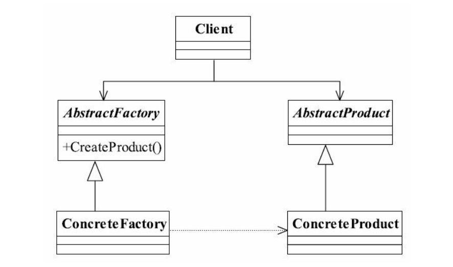
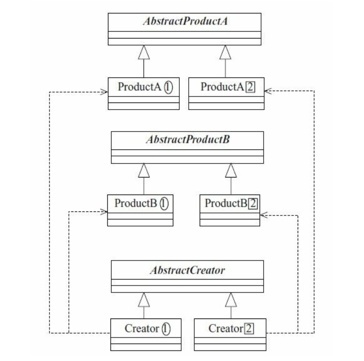

## java与设计模式-抽象工厂模式

### 一、定义

抽象工厂模式（Abstract Factory Pattern） 是一种比较常用的模式， 其定义如下：

Provide an interface for creating families of related or dependent objects without specifying
their concrete classes.（为创建一组相关或相互依赖的对象提供一个接口， 而且无须指定它们的具体类。 ）

### 二、通用类图



### 三、角色分析

抽象工厂模式是工厂方法模式的升级版本， 在有多个业务品种、 业务分类时， 通过抽象
工厂模式产生需要的对象是一种非常好的解决方式。 我们来看看抽象工厂的通用源代码， 首
先有两个互相影响的产品线（也叫做产品族） ， 例如制造汽车的左侧门和右侧门， 这两个应
该是数量相等的——两个对象之间的约束， 每个型号的车门都是不一样的， 这是产品等级结
构约束的， 我们先看看两个产品族的类图。




注意类图上的圈圈、 框框相对应， 两个抽象的产品类可以有关系， 例如共同继承或实现一个抽象类或接口。

**抽象产品类**
**具体的产品实现类**
**抽象工厂类**

抽象工厂类的职责是定义每个工厂要实现的功能， 在通用代码中， 抽象工厂类定义了两个产品族的产品创建。有N个产品族， 在抽象工厂类中就应该有N个创建方法。

**具体工厂类**

如何创建一个产品， 则是由具体的实现类来完成的。有M个产品等级就应该有M个实现工厂类， 在每个实现工厂中， 实现不同产品族的生产任务。

### 四、经典源码实现

**抽象产品类**

```java
public abstract class AbstractProductA {

    /**
     * 每个产品共有的方法
     */
    public void shareMethod() {
        System.out.println("Product A common method...");
    }

    /**
     * 每个产品相同的方法，不同的方法实现
     */
    public abstract void doSomething();
    
}
```

**具体产品类**

```java
public class ProductA1 extends AbstractProductA {

    @Override
    public void doSomething() {
        System.out.println("Product A1 的实现方法...");
    }
}
```

```java
public class ProductA2 extends AbstractProductA {

    @Override
    public void doSomething() {
        System.out.println("Product A2 的实现方法...");
    }
}
```


### 三、角色分析


