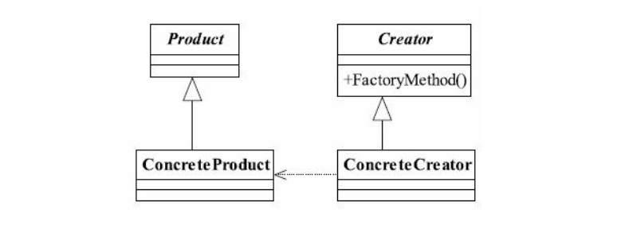
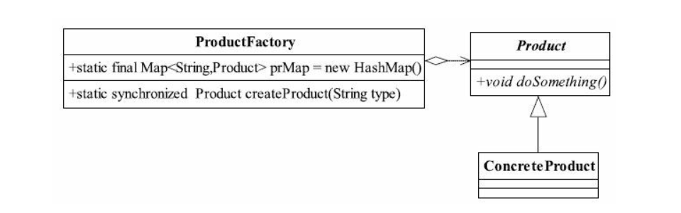

## java与设计模式-工厂方法模式

### 一、定义

工厂方法模式使用的频率非常高， 在我们日常的开发中总能见到它的身影。 其定义为：
Define an interface for creating an object,but let subclasses decide which class to
instantiate.Factory Method lets a class defer instantiation to subclasses.（定义一个用于创建对象的
接口， 让子类决定实例化哪一个类。 工厂方法使一个类的实例化延迟到其子类。 ）


### 二、通用类图



### 三、角色理解

**抽象产品类**

在工厂方法模式中， 抽象产品类Product负责定义产品的共性， 实现对事物最抽象的定义； 

**抽象创建类**

Creator为抽象创建类， 也就是抽象工厂， 具体如何创建产品类是由具体的实现工厂
ConcreteCreator完成的。 工厂方法模式的变种较多， 我们来看一个比较实用的通用源码。

### 四、通用源码

**抽象产品类**

```java
public abstract class Product {

    /**
     * 产品类的公共方法
     *
     */
    public void method01() {
        System.out.println("Product common do something...");
    }

    /**
     * 公共的抽象方法
     *
     */
    public abstract void method02();

}
```

**具体产品类**

具体的产品类可以有多个， 都继承于抽象产品类。

```java
public class ConcreteProduct01 extends Product {


    @Override
    public void method02() {
        System.out.println("ConcreteProduct01 method02...");
    }
}
```

```java
public class ConcreteProduct02 extends Product {


    @Override
    public void method02() {
        System.out.println("ConcreteProduct02 method02...");
    }
}
```

**抽象工厂类**

```java
public abstract class Factory {

    /**
     * 创建一个产品对象， 其输入参数类型可以自行设置
     * <p>通常为String、 Enum、 Class等， 当然也可以为空</p>
     *
     * @param clazz
     * @param <T>
     * @return
     */
    public abstract <T extends Product>  T getProduct(Class<T> clazz);
}
```

**具体工厂**

```java
public class ConcreteFactory extends Factory {
    @Override
    public <T extends Product> T getProduct(Class<T> clazz) {
        Product product = null;
        try {
            product = (Product) Class.forName(clazz.getName()).newInstance();
        } catch (Exception e) {
            e.printStackTrace();
        }
        return (T) product;
    }
}
```


### 五、工厂方法模式的应用

**5.1 工厂方法模式的优点**

首先， 良好的封装性， 代码结构清晰。 一个对象创建是有条件约束的， 如一个调用者需
要一个具体的产品对象， 只要知道这个产品的类名（或约束字符串） 就可以了， 不用知道创
建对象的艰辛过程， 降低模块间的耦合。

其次， 工厂方法模式的扩展性非常优秀。 在增加产品类的情况下， 只要适当地修改具体
的工厂类或扩展一个工厂类， 就可以完成“拥抱变化”。 例如在我们的例子中， 需要增加一个
棕色人种， 则只需要增加一个BrownHuman类， 工厂类不用任何修改就可完成系统扩展。

再次， 屏蔽产品类。 这一特点非常重要， 产品类的实现如何变化， 调用者都不需要关
心， 它只需要关心产品的接口， 只要接口保持不变， 系统中的上层模块就不要发生变化。 因
为产品类的实例化工作是由工厂类负责的， 一个产品对象具体由哪一个产品生成是由工厂类
决定的。 在数据库开发中， 大家应该能够深刻体会到工厂方法模式的好处： 如果使用JDBC
连接数据库， 数据库从MySQL切换到Oracle， 需要改动的地方就是切换一下驱动名称（前提
条件是SQL语句是标准语句） ， 其他的都不需要修改， 这是工厂方法模式灵活性的一个直接
案例。

最后， 工厂方法模式是典型的解耦框架。 高层模块值需要知道产品的抽象类， 其他的实
现类都不用关心， 符合迪米特法则， 我不需要的就不要去交流； 也符合依赖倒置原则， 只依
赖产品类的抽象； 当然也符合里氏替换原则， 使用产品子类替换产品父类， 没问题！

**5.2 工厂方法模式的使用场景**

首先， 工厂方法模式是new一个对象的替代品， 所以在所有需要生成对象的地方都可以
使用， 但是需要慎重地考虑是否要增加一个工厂类进行管理， 增加代码的复杂度。

其次， 需要灵活的、 可扩展的框架时， 可以考虑采用工厂方法模式。 万物皆对象， 那万
物也就皆产品类， 例如需要设计一个连接邮件服务器的框架， 有三种网络协议可供选择：
POP3、 IMAP、 HTTP， 我们就可以把这三种连接方法作为产品类， 定义一个接口如
IConnectMail， 然后定义对邮件的操作方法， 用不同的方法实现三个具体的产品类（也就是
连接方式） 再定义一个工厂方法， 按照不同的传入条件， 选择不同的连接方式。 如此设计，
可以做到完美的扩展， 如某些邮件服务器提供了WebService接口， 很好， 我们只要增加一个
产品类就可以了。

再次， 工厂方法模式可以用在异构项目中， 例如通过WebService与一个非Java的项目交
互， 虽然WebService号称是可以做到异构系统的同构化， 但是在实际的开发中， 还是会碰到
很多问题， 如类型问题、 WSDL文件的支持问题， 等等。 从WSDL中产生的对象都认为是一
个产品， 然后由一个具体的工厂类进行管理， 减少与外围系统的耦合。

最后， 可以使用在测试驱动开发的框架下。 例如， 测试一个类A， 就需要把与类A有关
联关系的类B也同时产生出来， 我们可以使用工厂方法模式把类B虚拟出来， 避免类A与类B
的耦合。 目前由于JMock和EasyMock的诞生， 该使用场景已经弱化了， 读者可以在遇到此种
情况时直接考虑使用JMock或EasyMock。

**5.3 工厂方法模式的扩展**

工厂方法模式有很多扩展， 而且与其他模式结合使用威力更大， 下面将介绍4种扩展。

_缩小为简单工厂模式_

我们这样考虑一个问题： 一个模块仅需要一个工厂类， 没有必要把它产生出来， 使用静态的方法就可以了.

该模式是工厂方法模式的弱化， 因为简单， 所以称为简单工厂模式（Simple Factory Pattern） ， 也叫做
静态工厂模式。 在实际项目中， 采用该方法的案例还是比较多的， 其缺点是工厂类的扩展比较困难， 不符合开闭原则， 但它仍然是一个非常实用的设计模式。

_升级为多个工厂类_

当我们在做一个比较复杂的项目时， 经常会遇到初始化一个对象很耗费精力的情况， 所有的产品类都放到一个工厂方法中进行初始化会使代码结构不清晰。 例如， 一个产品类有5
个具体实现， 每个实现类的初始化（不仅仅是new， 初始化包括new一个对象， 并对对象设置一定的初始值） 方法都不相同， 如果写在一个工厂方法中， 势必会导致该方法巨大无比，那该怎么办？

每一个产品类都对应了一个创建类， 好处就是创建类的职责清晰， 而且结构简单， 但是给可扩展性和可维护性带来了一定的影响。

为什么这么说呢？ 如果要扩展一个产品类， 就需要建立一个相应的工厂类， 这样就增加了扩展的难度。因为工厂类和产品类的数量相同， 维护时需要考虑两个对象之间的关系。
当然， 在复杂的应用中一般采用多工厂的方法， 然后再增加一个协调类， 避免调用者与各个子工厂交流， 协调类的作用是封装子工厂类， 对高层模块提供统一的访问接口。

_替代单例模式_

单例模式的核心要求就是在内存中只有一个对象， 通过工厂方法模式也可以只在内存中生产一个对象。

```java
public class Singleton {

    private Singleton() {}

    public void doSomething() {
        System.out.println("Singleton do something...");
    }
}
```

```java
public class SingletonFactory {

    private static Singleton singleton;

    static {
        try {
            Class clazz = Class.forName(Singleton.class.getName());
            Constructor constructor = clazz.getDeclaredConstructor();
            constructor.setAccessible(true);
            singleton = ((Singleton) constructor.newInstance());
        } catch (Exception e) {
            e.printStackTrace();
        }
    }

    public static Singleton getSingleton() {
        return singleton;
    }
}
```

以上通过工厂方法模式创建了一个单例对象， 该框架可以继续扩展， 在一个项目中可以
产生一个单例构造器， 所有需要产生单例的类都遵循一定的规则（构造方法是private） ， 然
后通过扩展该框架， 只要输入一个类型就可以获得唯一的一个实例。

_延迟初始化_

何为延迟初始化（Lazy initialization） ？ 一个对象被消费完毕后， 并不立刻释放， 工厂类
保持其初始状态， 等待再次被使用。 延迟初始化是工厂方法模式的一个扩展应用， 其通用类图.




代码还比较简单， 通过定义一个Map容器， 容纳所有产生的对象， 如果在Map容器中已
经有的对象， 则直接取出返回； 如果没有， 则根据需要的类型产生一个对象并放入到Map容
器中， 以方便下次调用。

延迟加载框架是可以扩展的， 例如限制某一个产品类的最大实例化数量， 可以通过判断
Map中已有的对象数量来实现， 这样的处理是非常有意义的， 例如JDBC连接数据库， 都会
要求设置一个MaxConnections最大连接数量， 该数量就是内存中最大实例化的数量。

延迟加载还可以用在对象初始化比较复杂的情况下， 例如硬件访问， 涉及多方面的交
互， 则可以通过延迟加载降低对象的产生和销毁带来的复杂性。


**5.4 最佳实践**

工厂方法模式在项目中使用得非常频繁， 以至于很多代码中都包含工厂方法模式。 该模
式几乎尽人皆知， 但不是每个人都能用得好。 熟能生巧， 熟练掌握该模式， 多思考工厂方法
如何应用， 而且工厂方法模式还可以与其他模式混合使用（例如模板方法模式、 单例模式、
原型模式等） ， 变化出无穷的优秀设计， 这也正是软件设计和开发的乐趣所在。


