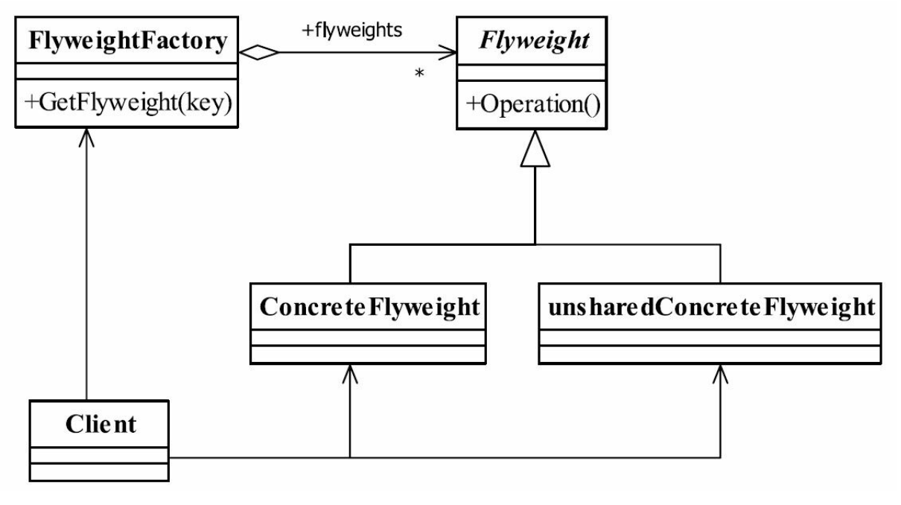

## java与设计模式-享元模式

### 一、定义

享元模式（Flyweight Pattern） 是池技术的重要实现方式， 其定义如下： Use sharing tosupport large numbers of fine-grained objects efficiently.（使用共享对象可有效地支持大量的细
粒度的对象。）

享元模式的定义为我们提出了两个要求： 细粒度的对象和共享对象。 我们知道分配太多的对象到应用程序中将有损程序的性能， 同时还容易造成内存溢出， 那怎么避免呢？ 就是享
元模式提到的共享技术。 我们先来了解一下对象的内部状态和外部状态。

要求细粒度对象， 那么不可避免地使得对象数量多且性质相近， 那我们就将这些对象的信息分为两个部分： 内部状态（intrinsic） 与外部状态（extrinsic） 。

- 内部状态

内部状态是对象可共享出来的信息， 存储在享元对象内部并且不会随环境改变而改变，如我们例子中的id、 postAddress等， 它们可以作为一个对象的动态附加信息， 不必直接储存
在具体某个对象中， 属于可以共享的部分。

- 外部状态

外部状态是对象得以依赖的一个标记， 是随环境改变而改变的、 不可以共享的状态， 如我们例子中的考试科目+考试地点复合字符串， 它是一批对象的统一标识， 是唯一的一个索引值。

### 二、通用类图



### 三、角色分析

- Flyweight-抽象享元角色

它简单地说就是一个产品的抽象类， 同时定义出对象的外部状态和内部状态的接口或实现。

- ConcreteFlyweight-具体享元角色

具体的一个产品类， 实现抽象角色定义的业务。 该角色中需要注意的是内部状态处理应该与环境无关， 不应该出现一个操作改变了内部状态， 同时修改了外部状态， 这是绝对不允许的。

- unsharedConcreteFlyweight-不可共享的享元角色

不存在外部状态或者安全要求（如线程安全） 不能够使用共享技术的对象， 该对象一般不会出现在享元工厂中。

- FlyweightFactory-享元工厂

职责非常简单， 就是构造一个池容器， 同时提供从池中获得对象的方法。

**享元模式的目的在于运用共享技术， 使得一些细粒度的对象可以共享， 我们的设计确实也应该这样， 多使用细粒度的对象， 便于重用或重构。**

### 四、经典代码实现

**抽象的享元角色**

```java
public abstract class FlyWeight {

    /**
     * 内部状态
     */
    private String intrinsic;

    /**
     * 外部状态
     * <p>{@code final}</p>
     */
    protected final String extrinsic;

    public FlyWeight(String extrinsic) {
        this.extrinsic = extrinsic;
    }

    /**
     * 定义业务操作
     */
    public abstract void operate();


    public String getIntrinsic() {
        return intrinsic;
    }

    public void setIntrinsic(String intrinsic) {
        this.intrinsic = intrinsic;
    }
}
```

抽象享元角色一般为抽象类， 在实际项目中， 一般是一个实现类， 它是描述一类事物的方法。 在抽象角色中， 一般需要把外部状态和内部状态（当然了， 可以没有内部状态， 只有
行为也是可以的） 定义出来， 避免子类的随意扩展。我们再来看具体的享元角色。

**具体享元角色**

```java
public class ConcreteFlyWeight01 extends FlyWeight {

    /**
     * 接受外部状态
     * @param extrinsic 外部状态
     */
    public ConcreteFlyWeight01(String extrinsic) {
        super(extrinsic);
    }

    /**
     * 根据外部状态进行逻辑处理
     */
    @Override
    public void operate() {
        System.out.println("业务处理1...");
    }
    
}
```

```java
public class ConcreteFlyWeight02 extends FlyWeight {

    /**
     * 接受外部状态
     * @param extrinsic 外部状态
     */
    public ConcreteFlyWeight02(String extrinsic) {
        super(extrinsic);
    }

    /**
     * 根据外部状态进行逻辑处理
     */
    @Override
    public void operate() {
        System.out.println("业务处理2...");
    }
    
}
```

这很简单， 实现自己的业务逻辑， 然后接收外部状态， 以便内部业务逻辑对外部状态的依赖。 注意， 我们在抽象享元中对外部状态加上了final关键字， 防止意外产生， 什么意外？获得了一个外部状态， 然后无意修改了一下， 池就混乱了！

>在程序开发中， 确认只需要一次赋值的属性则设置为final类型， 避免无意修改导致逻辑混乱， 特别是Session级的常量或变量.

**享元工厂**

```java
public class FlyWeightFactory {

    /**
     * 池容器
     */
    private static HashMap<String, FlyWeight> pool = new HashMap<>(32);

    /**
     * 享元模式工厂
     * @param extrinsic key
     * @return 享元对象
     */
    public static FlyWeight getFlyWeight(String extrinsic) {
        FlyWeight flyWeight = null;
        if (pool.containsKey(extrinsic)) {
            flyWeight = pool.get(extrinsic);
        } else {
            flyWeight = new ConcreteFlyWeight01(extrinsic);
            pool.put(extrinsic, flyWeight);
        }
        return flyWeight;
    }
}
```

**场景类**

```java
public class Main {

    public static void main(String[] args) {
        for (int i = 0; i < 100; i++) {
            String extrinsic = "key " + i;
            FlyWeight flyWeight = FlyWeightFactory.getFlyWeight(extrinsic);
            System.out.println(flyWeight);
        }
    }
}

```

打印结果如下：

```text
...
...省略了很多行
com.gyoomi.designpattern.flyweight.demo01.ConcreteFlyWeight01@1fb3ebeb
com.gyoomi.designpattern.flyweight.demo01.ConcreteFlyWeight01@548c4f57
com.gyoomi.designpattern.flyweight.demo01.ConcreteFlyWeight01@1218025c
com.gyoomi.designpattern.flyweight.demo01.ConcreteFlyWeight01@816f27d
```

### 五、享元模式的应用

**5.1 享元模式的优点**

享元模式是一个非常简单的模式， 它可以大大减少应用程序创建的对象， 降低程序内存的占用， 增强程序的性能， 但它同时也提高了系统复杂性， 需要分离出外部状态和内部状
态， 而且外部状态具有固化特性， 不应该随内部状态改变而改变， 否则导致系统的逻辑混乱。


**5.2 享元模式的缺点**

在一定程度上加重了系统的复杂性。

**5.3 享元模式的使用场景**

- 系统中存在大量的相似对象
- 细粒度的对象都具备较接近的外部状态， 而且内部状态与环境无关， 也就是说对象没有特定身份
- 需要缓冲池的场景

**5.4 享元模式的线程安全问题**


### 二、通用类图


