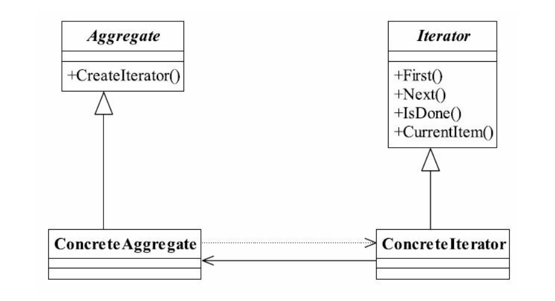

## java与设计模式-迭代器模式

### 一、定义

迭代器模式（Iterator Pattern） 目前已经是一个没落的模式， 基本上没人会单独写一个迭代器（不过作为学习的目的，它还是很有意义！）， 除非是产品性质的开发， 其定义如下：

Provide a way to access the elements of an aggregate object sequentially without exposing itsunderlying representation.（它提供一种方法访问一个容器对象中各个元素， 而又不需暴露该
对象的内部细节。 ）

迭代器是为容器服务的， 那什么是容器呢？ 能容纳对象的所有类型都可以称之为容器， 例如Collection集合类型、 Set类型等， 迭代器模式就是为解决遍历这些容器中的元素而诞生的。

### 二、通用类图



### 三、角色分析

迭代器模式提供了遍历容器的方便性， 容器只要管理增减元素就可以了， 需要遍历时交由迭代器进行。 迭代器模式正是由于使用得太频繁， 所以大家才会忽略， 我们来看看迭代器
模式中的各个角色：

- Iterator抽象迭代器

抽象迭代器负责定义访问和遍历元素的接口， 而且基本上是有固定的3个方法： first()获得第一个元素， next()访问下一个元素， isDone()是否已经访问到底部（Java叫做hasNext()方法） 。

- ConcreteIterator具体迭代器

具体迭代器角色要实现迭代器接口， 完成容器元素的遍历。

- Aggregate抽象容器

容器角色负责提供创建具体迭代器角色的接口， 必然提供一个类似createIterator()这样的方法， 在Java中一般是iterator()方法。

- Concrete Aggregate具体容器

具体容器实现容器接口定义的方法， 创建出容纳迭代器的对象。


### 四、经典源码实现

**Iterator抽象迭代器**

```java
public interface Iterator {

    /**
     * 遍历到下一个元素
     *
     * @return 下一个元素
     */
    Object next();

    /**
     * 是否已经遍历到尾部
     *
     * @return
     */
    boolean hasNext();

    /**
     * 删除当前指向的元素
     *
     * @return
     */
    boolean remove();
}
```

**具体迭代器**

```java
public class ConcreteIterator implements Iterator {

    private Vector vector = new Vector();


    /**
     * 定义当前游标
     */
    public int cursor = 0;

    public ConcreteIterator(Vector vector) {
        this.vector = vector;
    }

    /**
     * 返回下一个元素
     *
     * @return
     */
    @Override
    public Object next() {
        return this.hasNext() ? this.vector.get(cursor++) : null;
    }

    /**
     * 判断是否到达尾部
     *
     * @return
     */
    @Override
    public boolean hasNext() {
        return this.cursor < this.vector.size();
    }

    @Override
    public boolean remove() {
        this.vector.remove(this.cursor++);
        return true;
    }
}

```

**抽象容器**

```java
public interface Aggregate {

    /**
     * 是容器必然有元素的增加
     * @param object
     */
    void add(Object object);

    /**
     * 减少元素
     * @param object
     */
    void remove(Object object);

    /**
     * 由迭代器来遍历所有的元素
     * @return
     */
    Iterator iterator();
}

```

**具体容器**

```java
public class ConcreteAggregate implements Aggregate {

    /**
     * 容纳对象的容器
     */
    private Vector vector = new Vector();

    /**
     * 增加一个元素
     * @param object
     */
    @Override
    public void add(Object object) {
        this.vector.add(object);
    }

    /**
     * 返回迭代器对象
     * @param object
     */
    @Override
    public void remove(Object object) {
        this.vector.remove(object);
    }

    /**
     * 删除一个元素
     * @return
     */
    @Override
    public Iterator iterator() {
        return new ConcreteIterator(this.vector);
    }
}
```


**场景类**

```java
public class Main {

    public static void main(String[] args) {
        // 声明出容器
        Aggregate aggregate = new ConcreteAggregate();

        aggregate.add("aaa");
        aggregate.add("bbb");
        aggregate.add("ccc");
        aggregate.add("ddd");
        Iterator it = aggregate.iterator();
        // 遍历一下
        while (it.hasNext()) {
            System.out.println(it.next());
        }
    }
}
```

### 五、迭代器模式的应用

**5.1 迭代器模式的应用**

从JDK 1.2版本开始增加java.util.Iterator这个接口， 并逐步把Iterator应用到各个聚集类（Collection） 中， 我们来看JDK 1.5的API帮助文件， 你会看到有一个叫java.util.Iterable的接
口， 看看有多少个接口继承了它：BeanContext,BeanContextServices,BlockingQueue<E>,Collection<E>,List<E>,Queue<E>,Set<E>,Sor再看看有它多少个实现类：
AbstractCollection,AbstractList,AbstractQueue,AbstractSequentialList,AbstractSet,ArrayBlockingQue基本上我们经常使用的类都在这个表中了， 也正是因为Java把迭代器模式已经融入到基本
API中了， 我们才能如此轻松、 便捷。

我们再来看看Iterable接口。 java.util.Iterable接口只有一个方法： iterator()， 也就说， 通过iterator()这个方法去遍历聚集类中的所有方法或属性， 基本上现在所有的高级语言都有
Iterator这个接口或者实现， Java已经把迭代器给我们准备好了， 我们再去写迭代器， 就有点多余了。 所以呀， 这个迭代器模式也有点没落了， 基本上很少有项目再独立写迭代器了， 直
接使用Collection下的实现类就可以完美地解决问题。

迭代器现在应用得越来越广泛了， 甚至已经成为一个最基础的工具。 一些大师级人物甚至建议把迭代器模式从23个模式中删除， 为什么呢？ 就是因为现在它太普通了， 已经融入到
各个语言和工具中了， 比如PHP中你能找到它的身影， Perl也有它的存在， 甚至是前台的页面技术AJAX也可以有它的出现（如在Struts2中就可以直接使用iterator） 。 基本上， 只要你不
是在使用那些古董级（指版本号） 的编程语言的话， 都不用自己动手写迭代器。

**5.2 最佳实践**

如果你是做Java开发， 尽量不要自己写迭代器模式！ 省省吧， 使用Java提供的Iterator一般就能满足你的要求了。


