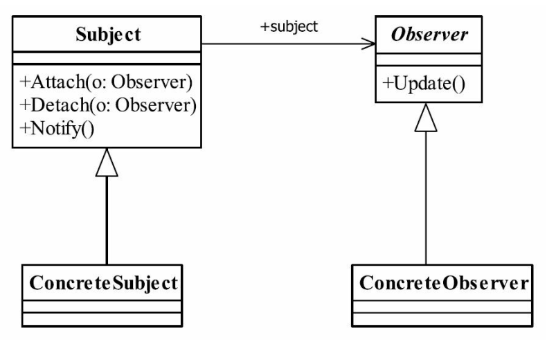

## java与设计模式-观察者模式

### 一、定义

观察者模式（Observer Pattern） 也叫做发布订阅模式（Publish/subscribe） ,它是一个在项
目中经常使用的模式， 其定义如下：

Define a one-to-many dependency between objects so that when one object changes state,all its
dependents are notified and updated automatically.（定义对象间一种一对多的依赖关系， 使得每
当一个对象改变状态， 则所有依赖于它的对象都会得到通知并被自动更新。 ）

### 二、通用类图




### 三、角色分析

- Subject被观察者
定义被观察者必须实现的职责， 它必须能够动态地增加、 取消观察者。 它一般是抽象类
或者是实现类， 仅仅完成作为被观察者必须实现的职责： 管理观察者并通知观察者。

- Observer观察者
观察者接收到消息后， 即进行update（更新方法） 操作， 对接收到的信息进行处理。

- ConcreteSubject具体的被观察者
定义被观察者自己的业务逻辑， 同时定义对哪些事件进行通知.

- ConcreteObserver具体的观察者
每个观察在接收到消息后的处理反应是不同， 各个观察者有自己的处理逻辑。


### 四、经典代码实现

**Observer观察者**

观察者一般是一个接口， 每一个实现该接口的实现类都是具体观察者。

```java
public interface Observer {

    /**
     * 更新方法
     */
    void update();
}
```

**Observer具体观察者1**

```java
public class ConcreteObserver01 implements Observer {


    @Override
    public void update() {
        System.out.println("间谍-01：观察到被观察者有变化，通知上级...");
    }
}
```

**Observer具体观察者2**

```java
public class ConcreteObserver02 implements Observer {


    @Override
    public void update() {
        System.out.println("间谍-02：观察到被观察者有变化，通知上级...");
    }
}
```

**被观察者**

被观察者的职责非常简单， 就是定义谁能够观察， 谁不能观察， 程序中使用ArrayList和Vector没有太大的差别， ArrayList是线程异步， 不安全； Vector是线程同步， 安全——就这点
区别。 我们再来看具体的被观察者。

```java
public abstract class Subject {

    /**
     * 观察者列表
     */
    private Vector<Observer> observers = new Vector<>();

    /**
     * 添加观察者
     *
     * @param observer 观察者
     */
    public void addObserver(Observer observer) {
        this.observers.add(observer);
    }


    /**
     * 删除观察者
     *
     * @param observer 观察者
     */
    public void removeObserver(Observer observer) {
        this.observers.remove(observer);
    }

    /**
     * 通知所有观察者
     *
     */
    public void notifyObserver() {
        observers.forEach(Observer::update);
    }

}

```


**具体被观察者**

```java
public class ConcreteSubject extends Subject {

    public void doSomething() {
        System.out.println("具体被观察者: 我进行了一些计算活动...");
        super.notifyObserver();
    }
}

```

**场景类**

```java
public class Main {

    public static void main(String[] args) {
        ConcreteSubject cs = new ConcreteSubject();
        ConcreteObserver01 co1 = new ConcreteObserver01();
        ConcreteObserver02 co2 = new ConcreteObserver02();

        cs.addObserver(co1);
        cs.addObserver(co2);
        cs.doSomething();
    }
}
```

运行结果：

```text
具体被观察者: 我进行了一些计算活动...
间谍-01：观察到被观察者有变化，通知上级...
间谍-02：观察到被观察者有变化，通知上级...
```

### 五、观察者模式的应用与理解

**5.1 观察者模式的优点**
- 观察者和被观察者之间是抽象耦合
如此设计， 则不管是增加观察者还是被观察者都非常容易扩展， 而且在Java中都已经实
现的抽象层级的定义， 在系统扩展方面更是得心应手

- 建立一套触发机制
根据单一职责原则， 每个类的职责是单一的， 那么怎么把各个单一的职责串联成真实世
界的复杂的逻辑关系呢？ 比如， 我们去打猎， 打死了一只母鹿， 母鹿有三个幼崽， 因失去了
母鹿而饿死， 尸体又被两只秃鹰争抢， 因分配不均， 秃鹰开始斗殴， 然后羸弱的秃鹰死掉，
生存下来的秃鹰， 则因此扩大了地盘……这就是一个触发机制， 形成了一个触发链。 观察者
模式可以完美地实现这里的链条形式。

**5.2 观察者模式的缺点**

观察者模式需要考虑一下开发效率和运行效率问题， 一个被观察者， 多个观察者， 开发
和调试就会比较复杂， 而且在Java中消息的通知默认是顺序执行， 一个观察者卡壳， 会影响
整体的执行效率。 在这种情况下， 一般考虑采用异步的方式。

多级触发时的效率更是让人担忧， 大家在设计时注意考虑。

**5.3 观察者模式的使用场景**

- 关联行为场景。 需要注意的是， 关联行为是可拆分的， 而不是“组合”关系。
- 事件多级触发场景。
- 跨系统的消息交换场景， 如消息队列的处理机制

**5.3 观察者模式的注意事项**


### 五、


