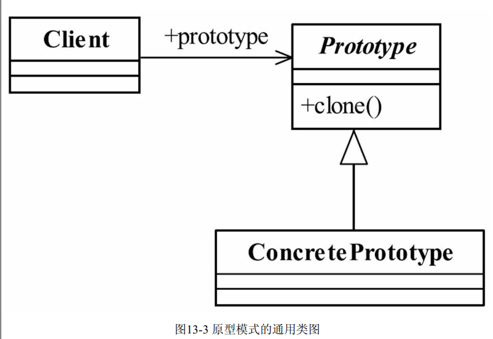
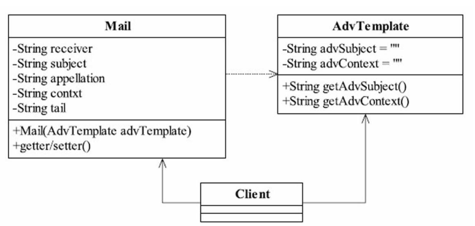

## java与设计模式-原型模式

### 一、原型模式的定义

`原型模式`（Prototype Pattern） 的简单程度仅次于单例模式和迭代器模式。 正是由于简
单， 使用的场景才非常地多， 其定义如下：

>Specify the kinds of objects to create using a prototypical instance,and create new objects by
 copying this prototype.（用原型实例指定创建对象的种类， 并且通过拷贝这些原型创建新的对
 象。 ）

### 二、原型模式的通用类图



### 三、示例及理解

**场景假设**

现在电子账单越来越流行了， 比如你的信用卡， 每到月初的时候银行就会发一份电子邮
件给你， 说你这个月消费了多少， 什么时候消费的， 积分是多少等， 这是每个月发一次。 还
有一种也是银行发的邮件你肯定非常有印象： 广告信， 现在各大银行的信用卡部门都在拉拢
客户， 电子邮件是一种廉价、 快捷的通信方式， 你用纸质的广告信那个费用多高呀， 比如我
行今天推出一个信用卡刷卡抽奖活动， 通过电子账单系统可以一个晚上发送给600万客户，
为什么要用电子账单系统呢？ 直接找个发垃圾邮件的工具不就解决问题了吗？ 是个好主意，
但是这个方案在金融行业是行不通的， 为什么？ 因为银行发送该类邮件是有要求的：

- 个性化服务
  
  一般银行都要求个性化服务， 发过去的邮件上总有一些个人信息吧， 比如“××先
  生”， “××女士”等
  
- 递送成功率
  
  邮件的递送成功率有一定的要求， 由于大批量地发送邮件会被接收方邮件服务器误认是
  垃圾邮件， 因此在邮件头要增加一些伪造数据， 以规避被反垃圾邮件引擎误认为是垃圾邮
  件。

从这两方面考虑广告信的发送也是电子账单系统（电子账单系统一般包括： 账单分析、
账单生成器、 广告信管理、 发送队列管理、 发送机、 退信处理、 报表管理等） 的一个子功
能， 我们今天就来考虑一下广告信这个模块是怎么开发的。 那既然是广告信， 肯定需要一个
模板， 然后再从数据库中把客户的信息一个一个地取出， 放到模板中生成一份完整的邮件，
然后扔给发送机进行发送处理， 在类图中AdvTemplate是广告信的模板， 一般都是从数据库取出， 生成一个BO或者是
DTO， 我们这里使用一个静态的值来作代表； Mail类是一封邮件类， 发送机发送的就是这个
类。



**广告信模板（AdvTemplate）**

```java
public class AdvTemplate {

    /**
     * 标题
     */
    private String advSubject = "中国银行国庆节抽奖活动";

    /**
     * 活动内容
     */
    private String advContext = "国庆节消费满8888元：就抽奖送你Iphone11等精彩大奖！！！";

    public String getAdvSubject() {
        return advSubject;
    }

    public String getAdvContext() {
        return advContext;
    }
}
```

**具体的邮件类（ConcreteTemplate）**

```java
public class Email {

    /**
     * 收件人
     */
    private String receiver;

    /**
     * 邮件名称
     */
    private String subject;

    /**
     * 称谓
     */
    private String appellation;

    /**
     * 邮件内容
     */
    private String context;

    /**
     * 尾部信息：一般包含xxx公司版权所有...
     */
    private String tail;

    public Email(AdvTemplate advTemplate) {
        this.context = advTemplate.getAdvContext();
        this.subject = advTemplate.getAdvSubject();
    }

    public String getReceiver() {
        return receiver;
    }

    public void setReceiver(String receiver) {
        this.receiver = receiver;
    }

    public String getSubject() {
        return subject;
    }

    public void setSubject(String subject) {
        this.subject = subject;
    }

    public String getAppellation() {
        return appellation;
    }

    public void setAppellation(String appellation) {
        this.appellation = appellation;
    }

    public String getContext() {
        return context;
    }

    public void setContext(String context) {
        this.context = context;
    }

    public String getTail() {
        return tail;
    }

    public void setTail(String tail) {
        this.tail = tail;
    }
}
```

**场景类（Client）**

```java
public class Client {

    private static int sendCount = 6;

    public static void main(String[] args) {
        // 模拟发送邮件
        Email email = new Email(new AdvTemplate());
        email.setTail("中国银行版权所有！！！");
        int i = 0;
        while (i < sendCount) {
            email.setAppellation(getRandomString() + " 先生或女士");
            email.setReceiver(getRandomString() + "@qq.com");
            sendEmail(email);
            i++;
        }
    }

    public static void sendEmail(Email email) {
        System.out.println("标题：" + email.getSubject() + "   收件人：" + email.getReceiver() + "发送成功...");
    }

    public static String getRandomString() {
        return Math.abs(new Random().nextInt()) + "";
    }
}
```

**思考**

我们再来仔细地想想， 这个程序是否有问题？ 其实这是一个线程（单线程）在运行， 也就是你发送的是单线程的， 那按照一封邮件发出去需要0.02秒（够小了， 你
还要到数据库中取数据呢） ， 600万封邮件需要33个小时， 也就是一个整天都发送不完， 今天的没发送完， 明天的账单又产生了， 日积月累， 激起甲方人员一堆抱怨， 那怎么办？


**解决方法：多线程**

把sendMail修改为多线程， 但是只把sendMail修改为多线程还是有问题的呀， 产
生第一封邮件对象， 放到线程1中运行， 还没有发送出去； 线程2也启动了， 直接就把邮件对
象mail的收件人地址和称谓修改掉了， 线程不安全了。 

**解决多线程出现的问题：原型**

说到这里， 你会说这有N多种解决办法， 其中一种是使用一种新型模式来解决这个问题： 通过对象的复制功能来解决这个问题。

增加了一个Cloneable接口（Java自带的一个接口） ， Mail实现了这个接口， 在Mail类中覆写clone()方法， 我们来看Mail类的改变，。

```java
public class Email implements Cloneable {
    
    // 其他不变
    
    @Override
    protected Email clone() {
        Email email = null;
        try {
            email = (Email) super.clone();
        } catch (CloneNotSupportedException e) {
            e.printStackTrace();
        }
        return email;
    }

}
```

这时Client客户端这样调用

```java
public class Client {

    private static int sendCount = 6;

    public static void main(String[] args) {
        // 模拟发送邮件
        Email email = new Email(new AdvTemplate());
        email.setTail("中国银行版权所有！！！");
        int i = 0;
        while (i < sendCount) {
            // 重点在这里*********
            Email cloneEmail = email.clone();
            cloneEmail.setAppellation(getRandomString() + " 先生或女士");
            cloneEmail.setReceiver(getRandomString() + "@qq.com");
            sendEmail(cloneEmail);
            i++;
        }
    }

    public static void sendEmail(Email email) {
        System.out.println("标题：" + email.getSubject() + "   收件人：" + email.getReceiver() + "发送成功...");
    }

    public static String getRandomString() {
        return Math.abs(new Random().nextInt()) + "";
    }
}
```

这样修改后，即使多线程发送，也不会存在线程安全问题。


### 四、分析

- Prototype Template


- Concrete Prototype

通常要实现Cloneable接口，实现clone()方法，实现对象的拷贝。

- Client

### 五、原型模式的优点

- 性能优良

原型模式是在内存二进制流的拷贝， 要比直接new一个对象性能好很多， 特别是要在一
个循环体内产生大量的对象时， 原型模式可以更好地体现其优点。

- 逃避构造函数的约束

这既是它的优点也是缺点， 直接在内存中拷贝， 构造函数是不会执行的。 优点就是减少了约束， 缺点也是减少了约束， 需要大家在实际应用时考虑。

### 六、原型模式的应用场景

- 资源优化场景

类初始化需要消化非常多的资源， 这个资源包括数据、 硬件资源等。

- 性能和安全要求的场景

通过new产生一个对象需要非常繁琐的数据准备或访问权限， 则可以使用原型模式。

- 一个对象多个修改者的场景

一个对象需要提供给其他对象访问， 而且各个调用者可能都需要修改其值时， 可以考虑
使用原型模式拷贝多个对象供调用者使用。

在实际项目中， 原型模式很少单独出现， 一般是和工厂方法模式一起出现， 通过clone的
方法创建一个对象， 然后由工厂方法提供给调用者。 原型模式已经与Java融为一体， 大家可以随手拿来使用。

### 七、其他

**原型模式的注意事项**

_构造函数不会被执行_。

一个实现了Cloneable并重写了clone方法的类A， 有一个无参构造或有参构造B， 通过
new关键字产生了一个对象S， 再然后通过S.clone()方式产生了一个新的对象T， 那么在对象
拷贝时构造函数B是不会被执行的。

**浅拷贝和深拷贝**

浅拷贝：

Java做了一个偷懒的拷贝动作， Object类提供
的方法clone只是拷贝本对象， 其对象内部的数组、 引用对象等都不拷贝， 还是指向原生对象
的内部元素地址， 这种拷贝就叫做浅拷贝。 确实是非常浅， 两个对象共享了一个私有变量，
你改我改大家都能改， 是一种非常不安全的方式， 在实际项目中使用还是比较少的（当然，
这也是一种“危机”环境的一种救命方式） 。 你可能会比较奇怪， 为什么在Mail那个类中就可
以使用String类型， 而不会产生由浅拷贝带来的问题呢？ 内部的数组和引用对象才不拷贝，
其他的原始类型比如int、 long、 char等都会被拷贝， 但是对于String类型， Java就希望你把它
认为是基本类型， 它是没有clone方法的， 处理机制也比较特殊， 通过字符串池（stringpool）
在需要的时候才在内存中创建新的字符串， 读者在使用的时候就把String当做基本类使用即
可。

>使用原型模式时， 引用的成员变量必须满足两个条件才不会被拷贝： 一是类的成
 员变量， 而不是方法内变量； 二是必须是一个可变的引用对象， 而不是一个原始类型或不可
 变对象

浅拷贝是有风险的， 那怎么才能深入地拷贝呢？ 

>深拷贝和浅拷贝建议不要混合使用， 特别是在涉及类的继承时， 父类有多个引用
 的情况就非常复杂， 建议的方案是深拷贝和浅拷贝分开实现.

**对象的clone与对象内的final关键字是有冲突的**

>要使用clone方法， 类的成员变量上不要增加final关键字.

**最佳实践**

原型模式先产生出一个包含大量共有信息的类， 然后可以拷贝出副本， 修正细节信息，
建立了一个完整的个性对象。 不知道大家有没有看过施瓦辛格演的《第六日》 这部电影， 电
影的主线也就是一个人被复制， 然后正本和副本对掐。 我们今天讲的原型模式也就是由一个
正本可以创建多个副本的概念。 可以这样理解： 一个对象的产生可以不由零起步， 直接从一
个已经具备一定雏形的对象克隆， 然后再修改为生产需要的对象。 也就是说， 产生一个人，
可以不从1岁长到2岁， 再到3岁……也可以直接找一个人， 从其身上获得DNA， 然后克隆一
个， 直接修改一下就是30岁了！ 我们讲的原型模式也就是这样的功能。


