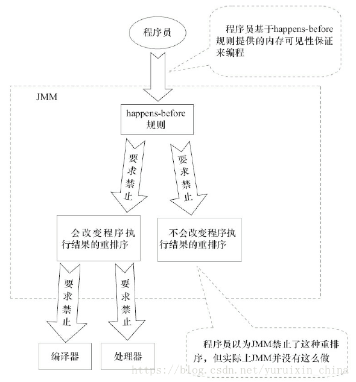

# java与设计模式-单例模式
## 错误写法分析
```
// 饱汉式
class SingleTon2{

    private SingleTon2 s;

    private SingleTon2(){}

    public SingleTon2 getInstance(){
        if (s == null) {
            synchronized (SingleTon2.class) {
                if (s == null) {
                    s = new SingleTon2();
                }
            }
        }
        return s;
    }

}
```

指令重排序是JVM为了优化指令，提高程序运行效率，在不影响单线程程序执行结果的前提下，尽可能地提高并行度。 
也就是说，JVM为了执行效率会将指令进行重新排序，但是这种重新排序不会对单线程程序产生影响。

首先，JVM是如何保证单线程下的指令在重新排序后执行结果不受影响的呢?

**happens-before**
定义如下：

>1.如果一个操作happens-before另一个操作，那么第一个操作的执行结果将对第二个操作可见，而且第一个操作的执行顺序排在第二个操作之前。
>
>2.两个操作之间存在happens-before关系，并不意味着Java平台的具体实现必须要按照happens-before关系指定的顺序来执行。如果重排序之后的执行结果，与按happens-before关系来执行的结果一致，那么这种重排序并不非法。

上面1是JMM对程序员的承诺。从程序员的角度来说，可以这样理解happens-before关系：如果A happens-before B，那么Java内存模型将向程序员保证——A操作的结果将对B可见，且A的执行顺序排在B之前。注意，这只是Java内存模型向程序员做出的保证！

上面2是JMM对编译器和处理器冲排序的约束。MM其实是在遵循一个基本原则：只要不改变程序的执行结果，编译器和处理器怎么优化都行。happens-before这么做的目的，都是为了在不改变程序执行结果的前提下，尽可能地提高程序执行的并行度。

**happens-before规则**

- 程序次序规则：一个线程内，按照代码顺序，书写在前面的操作先行发生于书写在后面的操作；
- 锁定规则：一个unLock操作先行发生于后面对同一个锁额lock操作；
- volatile变量规则：对一个变量的写操作先行发生于后面对这个变量的读操作；
- 传递规则：如果操作A先行发生于操作B，而操作B又先行发生于操作C，则可以得出操作A先行发生于操作C；
- 线程启动规则：Thread对象的start()方法先行发生于此线程的每个一个动作；
- 线程中断规则：对线程interrupt()方法的调用先行发生于被中断线程的代码检测到中断事件的发生；
- 线程终结规则：线程中所有的操作都先行发生于线程的终止检测，我们可以通过Thread.join()方法结束、Thread.isAlive()的返回值手段检测到线程已经终止执行；
- 对象终结规则：一个对象的初始化完成先行发生于他的finalize()方法的开始；


**解读**

- 程序次序规则：一段代码在单线程中执行的结果是有序的。注意是执行结果，因为虚拟机、处理器会对指令进行重排序（重排序后面会详细介绍）。虽然重排序了，但是并不会影响程序的执行结果，所以程序最终执行的结果与顺序执行的结果是一致的。故而这个规则只对单线程有效，在多线程环境下无法保证正确性。 
- 锁定规则：这个规则比较好理解，无论是在单线程环境还是多线程环境，一个锁处于被锁定状态，那么必须先执行unlock操作后面才能进行lock操作。 
- volatile变量规则：这是一条比较重要的规则，它标志着volatile保证了线程可见性。通俗点讲就是如果一个线程先去写一个volatile变量，然后一个线程去读这个变量，那么这个写操作一定是happens-before读操作的。 
- 传递规则：提现了happens-before原则具有传递性，即A happens-before B , B happens-before C，那么A happens-before C 
- 线程启动规则：假定线程A在执行过程中，通过执行ThreadB.start()来启动线程B，那么线程A对共享变量的修改在接下来线程B开始执行后确保对线程B可见。 
- 线程终结规则：假定线程A在执行的过程中，通过制定ThreadB.join()等待线程B终止，那么线程B在终止之前对共享变量的修改在线程A等待返回后可见。



```
public static SingletonTest getSingletonTest() {
     if (singletonTest == null) {
         // 若singletonTest为空，则加锁，再进一步判空
         synchronized (SingletonTest.class) {
             // 再判断一次是否为null
             if (singletonTest == null) {
                 //若为空，则创建一个新的实例
                 singletonTest = new SingletonTest();
             }
         }
     }
     return SingletonTest;
 }
```

由于singletonTest = new SingletonTest()操作并不是一个原子性指令，会被分为多个指令:

```
memory = allocate(); //1：分配对象的内存空间
ctorInstance(memory); //2：初始化对象
instance = memory; //3：设置instance指向刚分配的内存地址
```

但是经过重排序后如下：

```
memory = allocate(); //1：分配对象的内存空间
instance = memory; //3：设置instance指向刚分配的内存地址，此时对象还没被初始化
ctorInstance(memory); //2：初始化对象
```

若有A线程进行完重排后的第二步，且未执行初始化对象。此时B线程来取singletonTest时，发现singletonTest不为空，于是便返回该值，但由于没有初始化完该对象，此时返回的对象是有问题的。这也就是为什么说看似稳的一逼的代码，实则不堪一击。 
另外，在《java并发编程实战》16.2.4中对该种双重检查加锁（DCL）提出了批评。批评的主要点在于，该方式会导致上述指出的取到一个无效或错误状态的对象。 
上述代码的改进方法：将singletonTest声明为volatile类型即可（volatile有内存屏障的功能）。


