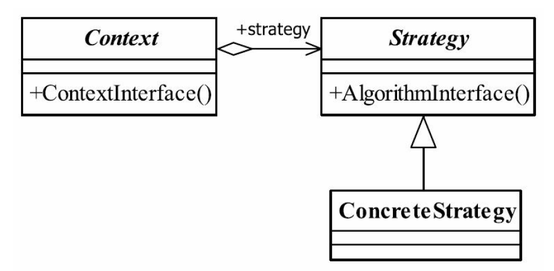
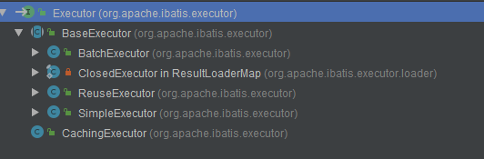

## java与设计模式-策略模式

### 一、策略模式的定义
策略模式（Strategy Pattern）是一种比较简单的模式，也叫做政策模式（Policy
Pattern）。其定义如下：

Define a family of algorithms,encapsulate each one,and make them interchangeable.（定义一组
算法，将每个算法都封装起来，并且使它们之间可以互换。）

### 二、策略模式的通用类图


### 三、分析
策略模式使用的就是面向对象的继承和多态机制，非常容易理解和掌握，我们再来看看
策略模式的三个角色：

1. Context封装角色

   它也叫做上下文角色，起承上启下封装作用，屏蔽高层模块对策略、算法的直接访问，
   封装可能存在的变化。
   
2. Strategy抽象策略角色

   策略、算法家族的抽象，通常为接口，定义每个策略或算法必须具有的方法和属性。各
   位看官可能要问了，类图中的AlgorithmInterface是什么意思，嘿嘿，algorithm是“运算法则”的
   意思，结合起来意思就明白了吧。
   
3. ConcreteStrategy具体策略角色

   实现抽象策略中的操作，该类含有具体的算法。
### 四、示例Demo
1. 抽象策略角色（一般是抽象类或接口）
   ```
   public interface IStrategy {
   
       void doSomething();
   }
   ```
2. 具体策略角色（实现类，实际项目中有多个）

   - 策略01
   ```
   public class ConcreateStrategy01 implements IStrategy {
   
       @Override
       public void doSomething() {
           System.out.println("具体策略运算法则1");
       }
   }

   ```
   - 策略02
   ```
   public class ConcreateStrategy02 implements IStrategy {
   
       @Override
       public void doSomething() {
           System.out.println("具体策略角色2");
       }
   }
   ```
3. 封装角色
   
   ```
   public class Context {
   
       private IStrategy iStrategy;
   
       public Context(IStrategy iStrategy) {
           this.iStrategy = iStrategy;
       }
   
       public void doAnything(){
           this.iStrategy.doSomething();
       }
   }
   ```
4. 高层模块
   
   所谓高层模块，在这里就是指的Main方法的调用。在实际的项目中可能存在于Controller中。
   
   ```
   public class Main {
   
       public static void main(String[] args) {
           IStrategy iStrategy = new ConcreateStrategy02();
           Context ctx = new Context(iStrategy);
           ctx.doAnything();
       }
   }
   ```
   
   运行结果：
   ```
    具体策略角色2
   ```
### 五、策略模式的应用
1. 策略模式的优点
   - 算法可以自由切换
     >这是策略模式本身定义的，只要实现抽象策略，它就成为策略家族的一个成员，通过封
      装角色对其进行封装，保证对外提供“可自由切换”的策略。
   - 避免使用多重条件判断
     >如果没有策略模式，我们想想看会是什么样子？一个策略家族有5个策略算法，一会要
      使用A策略，一会要使用B策略，怎么设计呢？使用多重的条件语句？多重条件语句不易维
      护，而且出错的概率大大增强。使用策略模式后，可以由其他模块决定采用何种策略，策略
      家族对外提供的访问接口就是封装类，简化了操作，同时避免了条件语句判断。
   - 扩展性良好
     >这甚至都不用说是它的优点，因为它太明显了。在现有的系统中增加一个策略太容易
      了，只要实现接口就可以了，其他都不用修改，类似于一个可反复拆卸的插件，这大大地符
      合了OCP原则。
2. 策略模式的缺点
   - 策略类数量增多
     >每一个策略都是一个类，复用的可能性很小，类数量增多。
   - 所有的策略类都需要对外暴露
     >上层模块必须知道有哪些策略，然后才能决定使用哪一个策略，这与迪米特法则是相违
      背的，我只是想使用了一个策略，我凭什么就要了解这个策略呢？那要你的封装类还有什么
      意义？这是原装策略模式的一个缺点，幸运的是，我们可以使用其他模式来修正这个缺陷，
      如工厂方法模式、代理模式或享元模式。
3. 策略模式的使用场景
   - 多个类只有在算法或行为上稍有不同的场景。
   - 算法需要自由切换的场景。
     >例如，算法的选择是由使用者决定的，或者算法始终在进化，特别是一些站在技术前沿
      的行业，连业务专家都无法给你保证这样的系统规则能够存在多长时间，在这种情况下策略
      模式是你最好的助手。
   - 需要屏蔽算法规则的场景。
     >现在的科技发展得很快，人脑的记忆是有限的（就目前来说是有限的），太多的算法你
      只要知道一个名字就可以了，传递相关的数字进来，反馈一个运算结果，万事大吉。
4. 策略模式的注意事项
   - 如果系统中的一个策略家族的具体策略数量超过4个，则需要考虑使用混合模式，解决
     策略类膨胀和对外暴露的问题，否则日后的系统维护就会成为一个烫手山芋，谁都不想接。

### 六、策略模式的扩展
1. 正常的策略模式
2. 枚举策略
   
   ``` 
   public enum CalculatorEnum {
   
       ADD("+") {
           public int exec(int a, int b) {
               return a + b;
           }
       },
   
       SUB("-") {
           public int exec(int a, int b) {
               return a - b;
           }
       };
   
       private String value;
   
       CalculatorEnum(String value) {
           this.value = value;
       }
   
       public String getValue() {
           return this.value;
       }
   
       public abstract int exec(int a, int b);
   }
   ```
   
   ``` 
   30
   -10
   ```
   
### 七、最佳实践
策略模式是一个非常简单的模式。它在项目中使用得非常多，但它单独使用的地方就比
较少了，因为它有致命缺陷：所有的策略都需要暴露出去，这样才方便客户端决定使用哪一
个策略。

在实际项目中，我们一般通过工厂方法模式来实现策略类的声明，读者可以参考
混编模式。后面我们在继续介绍混编模式。

### 八、Spring和MyBatis中的使用
1. MyBatis与策略模式

   MyBatis配置文件mybatis-config.xml中的节点settings中有一项配置如下:
   
   ``` <setting name="defaultExecutorType" value="SIMPLE" /> ```
   
   配置的是MyBatis在运行过程中默认的执行器Executor，此项配置的默认值就是SIMPLE，指向就是接口Executor的实现类SimpleExecutor。
   
   通过查看源码可以看得到接口Executor的继承关系如下：
   
   
   
   这些实现类为接口Executor的策略簇，实现了不同的执行器策略：
   
   ```
   SimpleExecutor：普通的执行器
   BatchExecutor：批处理执行器
   ReuseExecutor：预处理语句重用执行器

   ```
   
   MyBatis中DefaultSqlSession似于策略模式中的Context。
2. Spring与策略模式
   后面补充。


